# Improved Questionnaire Workflow State Machine

## Problem Statement

The original design had several issues:
1. **Two workflow types not clearly differentiated** (Simple vs Complex)
2. **Simple workflow jumps directly to Finalized** (missing Submitted state)
3. **No backward transitions** (no way to reopen/correct)
4. **No admin override capabilities**

## Solution: Dual-Track Workflow with Reopening

---

## 1. Two Distinct Workflow Types


---

## 2. Complete State Diagram with Forward & Backward Transitions

```mermaid
stateDiagram-v2
    [*] --> Assigned: Create Assignment

    %% FORWARD TRANSITIONS (Normal Flow)
    Assigned --> EmployeeInProgress: Employee starts
    Assigned --> ManagerInProgress: Manager starts
    Assigned --> BothInProgress: Both start

    EmployeeInProgress --> BothInProgress: Manager starts
    EmployeeInProgress --> EmployeeSubmitted: Employee submits

    ManagerInProgress --> BothInProgress: Employee starts
    ManagerInProgress --> ManagerSubmitted: Manager submits

    BothInProgress --> EmployeeSubmitted: Employee submits
    BothInProgress --> ManagerSubmitted: Manager submits

    EmployeeSubmitted --> BothSubmitted: Manager submits
    ManagerSubmitted --> BothSubmitted: Employee submits

    BothSubmitted --> InReview: Manager initiates review

    InReview --> ManagerReviewConfirmed: Manager finishes review

    ManagerReviewConfirmed --> EmployeeReviewConfirmed: Employee confirms

    EmployeeReviewConfirmed --> Finalized: Manager finalizes

    %% SIMPLE WORKFLOW (No Manager Review)
    EmployeeSubmitted --> Finalized: Auto-finalize (no mgr review)

    %% BACKWARD TRANSITIONS (Reopening for Corrections)
    EmployeeSubmitted --> EmployeeInProgress: 🔓 Reopen by Admin/HR
    ManagerSubmitted --> ManagerInProgress: 🔓 Reopen by Admin/HR
    BothSubmitted --> BothInProgress: 🔓 Reopen by Admin/HR

    ManagerReviewConfirmed --> InReview: 🔓 Reopen review by Admin/HR
    EmployeeReviewConfirmed --> InReview: 🔓 Reopen review by Admin/HR

    %% TERMINAL STATE
    Finalized --> [*]: Complete (Locked)

    %% Styling
    classDef workPhase fill:#e3f2fd,stroke:#1976d2,stroke-width:2px
    classDef submissionPhase fill:#fff3e0,stroke:#f57c00,stroke-width:2px
    classDef reviewPhase fill:#f3e5f5,stroke:#7b1fa2,stroke-width:2px
    classDef confirmPhase fill:#e8f5e9,stroke:#388e3c,stroke-width:2px
    classDef finalPhase fill:#e0e0e0,stroke:#424242,stroke-width:3px
    classDef reopenTransition stroke:#d32f2f,stroke-width:3px,stroke-dasharray: 5 5

    class Assigned,EmployeeInProgress,ManagerInProgress,BothInProgress workPhase
    class EmployeeSubmitted,ManagerSubmitted,BothSubmitted submissionPhase
    class InReview reviewPhase
    class ManagerReviewConfirmed,EmployeeReviewConfirmed confirmPhase
    class Finalized finalPhase
```



**Legend:**
- **Solid arrows** → Forward transitions (normal flow)
- **Dashed arrows (🔓)** → Backward transitions (admin reopening)

---

## 3. Simple Workflow (Employee-Only) - Detailed

```mermaid
stateDiagram-v2
    [*] --> Assigned: HR assigns to Employee

    Assigned --> EmployeeInProgress: Employee starts filling

    EmployeeInProgress --> EmployeeSubmitted: Employee clicks Submit

    note right of EmployeeSubmitted
        NEW STATE!
        Employee has submitted.
        Waiting for HR/Admin approval
        or auto-finalize.
    end note

    EmployeeSubmitted --> Finalized: Auto-finalize (RequiresManagerReview=false)

    %% REOPENING
    EmployeeSubmitted --> EmployeeInProgress: 🔓 HR/Admin reopens for corrections

    Finalized --> [*]: Locked

    classDef submitted fill:#4caf50,stroke:#2e7d32,stroke-width:3px
    class EmployeeSubmitted submitted
```



**Key Changes:**
1. ✅ **EmployeeSubmitted state is now explicit** (not auto-finalized immediately)
2. ✅ **HR/Admin can reopen** from EmployeeSubmitted → EmployeeInProgress
3. ✅ **Clear transition to Finalized** after submission validation

---

## 4. Complex Workflow (With Manager Review) - Detailed


---

## 5. Reopening Permissions Matrix

| Current State | Can Reopen To | Who Can Reopen? | Business Reason |
|--------------|---------------|-----------------|-----------------|
| **EmployeeSubmitted** | EmployeeInProgress | HR, Admin, TeamLead (own team) | Employee made errors, needs corrections |
| **ManagerSubmitted** | ManagerInProgress | HR, Admin, TeamLead (own team) | Manager made errors, needs corrections |
| **BothSubmitted** | BothInProgress | HR, Admin, TeamLead (own team) | Both need corrections before review |
| **ManagerReviewConfirmed** | InReview | HR, Admin | Manager wants to revise review summary |
| **EmployeeReviewConfirmed** | InReview | HR, Admin | Employee wants to contest review outcome |
| **Finalized** | *(Cannot reopen)* | *(No one)* | **Terminal state - Must create new assignment** |

**Authorization Hierarchy:**
- **Admin**: Can reopen ANY non-finalized state for ALL questionnaires
- **HR**: Can reopen ANY non-finalized state for ALL questionnaires
- **TeamLead**: Can reopen ALL non-finalized states for THEIR TEAM ONLY (data-scoped)
- **Manager**: Cannot reopen (must request from Admin/HR/TeamLead)
- **Employee**: Cannot reopen (must request from Admin/HR/TeamLead)

**Important Notes:**
- 🔒 **Finalized state CANNOT be reopened** - If changes needed, create a new assignment
- 📧 **Email notification sent** to employee/manager when questionnaire is reopened
- ✏️ **Reopen reason is REQUIRED** - Must provide explanation in UI dialog

---

## 6. Updated State Transition Matrix

```mermaid
graph TD
    A[Command Received] --> B{Check Authorization}
    B -->|Unauthorized| Reject1[❌ 403 Forbidden]
    B -->|Authorized| C{Is Forward Transition?}

    C -->|Yes| D[WorkflowStateMachine.CanTransitionForward]
    C -->|No - Backward| E[WorkflowStateMachine.CanTransitionBackward]

    D --> F{Valid Forward?}
    F -->|No| Reject2[❌ Invalid Forward Transition]
    F -->|Yes| Success1[✅ Raise WorkflowStateTransitioned]

    E --> G{Valid Backward?}
    G -->|No| Reject3[❌ Invalid Backward Transition]
    G -->|Yes| H{Has Reopen Permission?}

    H -->|No| Reject4[❌ Insufficient Permissions]
    H -->|Yes| Success2[✅ Raise WorkflowReopened Event]

    style Reject1 fill:#ffcdd2,stroke:#c62828
    style Reject2 fill:#ffcdd2,stroke:#c62828
    style Reject3 fill:#ffcdd2,stroke:#c62828
    style Reject4 fill:#ffcdd2,stroke:#c62828
    style Success1 fill:#c8e6c9,stroke:#2e7d32
    style Success2 fill:#c8e6c9,stroke:#2e7d32
```



---

## 7. New Domain Events

### 7.1 WorkflowReopened Event

```csharp
/// <summary>
/// Domain event raised when a workflow is reopened by an administrator.
/// This is a special backward transition for corrections.
/// </summary>
public record WorkflowReopened(
    Guid AssignmentId,
    WorkflowState FromState,
    WorkflowState ToState,
    string ReopenReason,
    DateTime ReopenedAt,
    Guid ReopenedByEmployeeId,
    string ReopenedByRole) : IDomainEvent;
```

### 7.2 EmployeeQuestionnaireSubmitted (Updated)

```csharp
/// <summary>
/// Raised when employee submits their portion of the questionnaire.
/// In simple workflow: triggers auto-finalization
/// In complex workflow: waits for manager submission
/// </summary>
public record EmployeeQuestionnaireSubmitted(
    DateTime SubmittedDate,
    Guid SubmittedByEmployeeId,
    bool RequiresManagerReview) : IDomainEvent;
```

---

## 8. Updated WorkflowTransitions.cs

```csharp
namespace ti8m.BeachBreak.Domain.QuestionnaireAssignmentAggregate;

public static class WorkflowTransitions
{
    /// <summary>
    /// Forward transitions (normal workflow progression)
    /// </summary>
    public static readonly Dictionary<WorkflowState, List<StateTransition>> ForwardTransitions = new()
    {
        [WorkflowState.Assigned] = new List<StateTransition>
        {
            new(WorkflowState.EmployeeInProgress, "Employee starts filling sections"),
            new(WorkflowState.ManagerInProgress, "Manager starts filling sections"),
            new(WorkflowState.BothInProgress, "Both start filling sections")
        },

        [WorkflowState.EmployeeInProgress] = new List<StateTransition>
        {
            new(WorkflowState.BothInProgress, "Manager starts filling sections"),
            new(WorkflowState.EmployeeSubmitted, "Employee submits questionnaire")
        },

        [WorkflowState.ManagerInProgress] = new List<StateTransition>
        {
            new(WorkflowState.BothInProgress, "Employee starts filling sections"),
            new(WorkflowState.ManagerSubmitted, "Manager submits questionnaire")
        },

        [WorkflowState.BothInProgress] = new List<StateTransition>
        {
            new(WorkflowState.EmployeeSubmitted, "Employee submits first"),
            new(WorkflowState.ManagerSubmitted, "Manager submits first")
        },

        [WorkflowState.EmployeeSubmitted] = new List<StateTransition>
        {
            new(WorkflowState.BothSubmitted, "Manager submits questionnaire"),
            new(WorkflowState.Finalized, "Auto-finalize (no manager review required)")
        },

        [WorkflowState.ManagerSubmitted] = new List<StateTransition>
        {
            new(WorkflowState.BothSubmitted, "Employee submits questionnaire")
        },

        [WorkflowState.BothSubmitted] = new List<StateTransition>
        {
            new(WorkflowState.InReview, "Manager initiates review meeting")
        },

        [WorkflowState.InReview] = new List<StateTransition>
        {
            new(WorkflowState.ManagerReviewConfirmed, "Manager finishes review meeting")
        },

        [WorkflowState.ManagerReviewConfirmed] = new List<StateTransition>
        {
            new(WorkflowState.EmployeeReviewConfirmed, "Employee confirms review outcome")
        },

        [WorkflowState.EmployeeReviewConfirmed] = new List<StateTransition>
        {
            new(WorkflowState.Finalized, "Manager finalizes questionnaire")
        },

        [WorkflowState.Finalized] = new List<StateTransition>() // Terminal state
    };

    /// <summary>
    /// Backward transitions (reopening for corrections)
    /// Requires special permissions: Admin, HR, or TeamLead
    /// </summary>
    public static readonly Dictionary<WorkflowState, List<ReopenTransition>> BackwardTransitions = new()
    {
        [WorkflowState.EmployeeSubmitted] = new List<ReopenTransition>
        {
            new(WorkflowState.EmployeeInProgress,
                "Reopen employee questionnaire for corrections",
                new[] { "Admin", "HR", "TeamLead" })
        },

        [WorkflowState.ManagerSubmitted] = new List<ReopenTransition>
        {
            new(WorkflowState.ManagerInProgress,
                "Reopen manager questionnaire for corrections",
                new[] { "Admin", "HR", "TeamLead" })
        },

        [WorkflowState.BothSubmitted] = new List<ReopenTransition>
        {
            new(WorkflowState.BothInProgress,
                "Reopen both questionnaires for corrections",
                new[] { "Admin", "HR", "TeamLead" })
        },

        [WorkflowState.ManagerReviewConfirmed] = new List<ReopenTransition>
        {
            new(WorkflowState.InReview,
                "Reopen review meeting for manager revisions",
                new[] { "Admin", "HR", "TeamLead" })
        },

        [WorkflowState.EmployeeReviewConfirmed] = new List<ReopenTransition>
        {
            new(WorkflowState.InReview,
                "Reopen review meeting after employee confirmation",
                new[] { "Admin", "HR", "TeamLead" })
        }
    };

    public record StateTransition(WorkflowState TargetState, string TriggerDescription);

    public record ReopenTransition(
        WorkflowState TargetState,
        string ReopenReason,
        string[] AllowedRoles);
}
```

---

## 9. Updated WorkflowStateMachine.cs

```csharp
namespace ti8m.BeachBreak.Domain.QuestionnaireAssignmentAggregate;

public class WorkflowStateMachine
{
    /// <summary>
    /// Validates forward (normal) state transition
    /// </summary>
    public static ValidationResult CanTransitionForward(
        WorkflowState currentState,
        WorkflowState targetState,
        out string? failureReason)
    {
        if (currentState == WorkflowState.Finalized)
        {
            failureReason = "Cannot transition from Finalized state";
            return ValidationResult.Invalid;
        }

        if (!WorkflowTransitions.ForwardTransitions.TryGetValue(currentState, out var validTransitions))
        {
            failureReason = $"Unknown current state: {currentState}";
            return ValidationResult.Invalid;
        }

        if (!validTransitions.Any(t => t.TargetState == targetState))
        {
            failureReason = $"Invalid forward transition from {currentState} to {targetState}";
            return ValidationResult.Invalid;
        }

        failureReason = null;
        return ValidationResult.Valid;
    }

    /// <summary>
    /// Validates backward (reopening) state transition
    /// </summary>
    public static ValidationResult CanTransitionBackward(
        WorkflowState currentState,
        WorkflowState targetState,
        string userRole,
        out string? failureReason)
    {
        if (currentState == WorkflowState.Finalized)
        {
            failureReason = "Cannot reopen Finalized state - locked permanently";
            return ValidationResult.Invalid;
        }

        if (!WorkflowTransitions.BackwardTransitions.TryGetValue(currentState, out var reopenTransitions))
        {
            failureReason = $"State {currentState} cannot be reopened";
            return ValidationResult.Invalid;
        }

        var transition = reopenTransitions.FirstOrDefault(t => t.TargetState == targetState);
        if (transition == null)
        {
            failureReason = $"Invalid reopen transition from {currentState} to {targetState}";
            return ValidationResult.Invalid;
        }

        if (!transition.AllowedRoles.Contains(userRole))
        {
            failureReason = $"Role {userRole} is not authorized to reopen from {currentState}. Allowed roles: {string.Join(", ", transition.AllowedRoles)}";
            return ValidationResult.Invalid;
        }

        failureReason = null;
        return ValidationResult.Valid;
    }

    /// <summary>
    /// Determines if a state can be reopened by any role
    /// </summary>
    public static bool IsReopenable(WorkflowState state)
    {
        return WorkflowTransitions.BackwardTransitions.ContainsKey(state);
    }

    /// <summary>
    /// Gets roles that can reopen a specific state
    /// </summary>
    public static string[] GetRolesWhoCanReopen(WorkflowState state)
    {
        if (!WorkflowTransitions.BackwardTransitions.TryGetValue(state, out var transitions))
            return Array.Empty<string>();

        return transitions
            .SelectMany(t => t.AllowedRoles)
            .Distinct()
            .ToArray();
    }

    public enum ValidationResult
    {
        Valid,
        Invalid
    }
}
```

---

## 10. New Command: ReopenQuestionnaireCommand

```csharp
namespace ti8m.BeachBreak.Application.Command.Commands.QuestionnaireAssignmentCommands;

/// <summary>
/// Command to reopen a questionnaire that has been submitted or confirmed.
/// Requires Admin, HR, or TeamLead role.
/// </summary>
public record ReopenQuestionnaireCommand(
    Guid AssignmentId,
    WorkflowState TargetState,
    string ReopenReason,
    Guid ReopenedByEmployeeId,
    string ReopenedByRole) : ICommand<Result>;
```

### Command Handler

```csharp
public class ReopenQuestionnaireCommandHandler
    : ICommandHandler<ReopenQuestionnaireCommand, Result>
{
    private readonly IQuestionnaireAssignmentRepository _repository;
    private readonly ILogger<ReopenQuestionnaireCommandHandler> _logger;

    public async Task<Result> Handle(
        ReopenQuestionnaireCommand command,
        CancellationToken ct)
    {
        var assignment = await _repository.GetByIdAsync(command.AssignmentId, ct);
        if (assignment == null)
            return Result.Fail("Assignment not found", 404);

        try
        {
            // Validate backward transition with role check
            var validationResult = WorkflowStateMachine.CanTransitionBackward(
                assignment.WorkflowState,
                command.TargetState,
                command.ReopenedByRole,
                out var failureReason);

            if (validationResult == WorkflowStateMachine.ValidationResult.Invalid)
            {
                _logger.LogWarning(
                    "Reopen rejected: {Reason} (Assignment: {AssignmentId}, User: {UserId}, Role: {Role})",
                    failureReason,
                    command.AssignmentId,
                    command.ReopenedByEmployeeId,
                    command.ReopenedByRole);

                return Result.Fail(failureReason ?? "Invalid reopen transition", 403);
            }

            // Execute reopen
            assignment.ReopenWorkflow(
                command.TargetState,
                command.ReopenReason,
                command.ReopenedByEmployeeId,
                command.ReopenedByRole);

            await _repository.UpdateAsync(assignment, ct);

            _logger.LogInformation(
                "Questionnaire reopened: {AssignmentId} from {FromState} to {ToState} by {Role}",
                command.AssignmentId,
                assignment.WorkflowState,
                command.TargetState,
                command.ReopenedByRole);

            return Result.Success();
        }
        catch (InvalidWorkflowTransitionException ex)
        {
            _logger.LogError(ex, "Failed to reopen questionnaire: {AssignmentId}", command.AssignmentId);
            return Result.Fail(ex.Message, 400);
        }
    }
}
```

---

## 11. Updated QuestionnaireAssignment Aggregate

```csharp
public class QuestionnaireAssignment : AggregateRoot
{
    // ... existing properties ...

    /// <summary>
    /// Reopens the workflow to a previous state for corrections.
    /// Requires Admin, HR, or TeamLead authorization.
    /// </summary>
    public void ReopenWorkflow(
        WorkflowState targetState,
        string reopenReason,
        Guid reopenedByEmployeeId,
        string reopenedByRole)
    {
        if (IsLocked)
            throw new InvalidOperationException("Cannot reopen - questionnaire is finalized and locked");

        if (IsWithdrawn)
            throw new InvalidOperationException("Cannot reopen - assignment is withdrawn");

        var validationResult = WorkflowStateMachine.CanTransitionBackward(
            WorkflowState,
            targetState,
            reopenedByRole,
            out var failureReason);

        if (validationResult == WorkflowStateMachine.ValidationResult.Invalid)
        {
            throw new InvalidWorkflowTransitionException(
                WorkflowState,
                targetState,
                failureReason ?? "Reopen not allowed");
        }

        RaiseEvent(new WorkflowReopened(
            Id,
            WorkflowState,
            targetState,
            reopenReason,
            DateTime.UtcNow,
            reopenedByEmployeeId,
            reopenedByRole
        ));
    }

    public void Apply(WorkflowReopened @event)
    {
        WorkflowState = @event.ToState;

        // Reset submission flags based on target state
        if (@event.ToState == WorkflowState.EmployeeInProgress)
        {
            EmployeeSubmittedDate = null;
            EmployeeSubmittedByEmployeeId = null;
        }
        else if (@event.ToState == WorkflowState.ManagerInProgress)
        {
            ManagerSubmittedDate = null;
            ManagerSubmittedByEmployeeId = null;
        }
        else if (@event.ToState == WorkflowState.BothInProgress)
        {
            EmployeeSubmittedDate = null;
            EmployeeSubmittedByEmployeeId = null;
            ManagerSubmittedDate = null;
            ManagerSubmittedByEmployeeId = null;
        }
        else if (@event.ToState == WorkflowState.InReview)
        {
            // Reset review confirmation flags
            ManagerReviewFinishedDate = null;
            ManagerReviewFinishedByEmployeeId = null;
            EmployeeReviewConfirmedDate = null;
            EmployeeReviewConfirmedByEmployeeId = null;
        }
    }
}
```

---

## 12. Simple Workflow Example (Employee-Only)

```mermaid
sequenceDiagram
    participant HR as HR Admin
    participant E as Employee
    participant Agg as QuestionnaireAssignment
    participant SM as StateMachine

    HR->>Agg: Create Assignment (RequiresManagerReview=false)
    Note over Agg: State: Assigned

    E->>Agg: Complete sections
    Agg->>SM: DetermineProgressState()
    SM-->>Agg: EmployeeInProgress
    Note over Agg: State: EmployeeInProgress

    E->>Agg: SubmitEmployeeQuestionnaire()
    Agg->>Agg: Raise EmployeeQuestionnaireSubmitted
    Note over Agg: State: EmployeeSubmitted ✅ NEW STATE

    alt No Errors - Auto-Finalize (IMMEDIATE)
        Agg->>SM: Check RequiresManagerReview
        SM-->>Agg: false → Auto-finalize immediately
        Agg->>Agg: Raise QuestionnaireAutoFinalized
        Note over Agg: State: Finalized 🔒
        Note over E: Employee receives confirmation email
    else Employee Made Errors - Reopen
        HR->>HR: Opens Reopen Dialog (reason REQUIRED)
        HR->>Agg: ReopenWorkflow(EmployeeInProgress, "Employee needs to fix section 3")
        Agg->>SM: CanTransitionBackward(EmployeeSubmitted, EmployeeInProgress, "HR")
        SM-->>Agg: Valid ✅
        Agg->>Agg: Raise WorkflowReopened
        Note over Agg: State: EmployeeInProgress (reopened)
        Agg->>E: Send email notification with reason
        E->>Agg: Fix errors and resubmit
        Agg->>Agg: SubmitEmployeeQuestionnaire() again
        Note over Agg: State: EmployeeSubmitted → Finalized (immediate)
    end
```



---

## 13. Complex Workflow with Reopening Example


---

## 14. Authorization Matrix for Reopening

```mermaid
graph TB
    subgraph "Who Can Reopen?"
        Admin[Admin Role]
        HR[HR Role]
        TL[TeamLead Role]
        Mgr[Manager]
        Emp[Employee]
    end

    subgraph "Submission States"
        ES[EmployeeSubmitted]
        MS[ManagerSubmitted]
        BS[BothSubmitted]
    end

    subgraph "Review States"
        MRC[ManagerReviewConfirmed]
        ERC[EmployeeReviewConfirmed]
    end

    subgraph "Final State"
        F[Finalized]
    end

    Admin -->|✅ Can Reopen ALL| ES & MS & BS & MRC & ERC
    HR -->|✅ Can Reopen ALL| ES & MS & BS & MRC & ERC
    TL -->|✅ Can Reopen OWN TEAM| ES & MS & BS & MRC & ERC
    Mgr -.❌ Cannot Reopen.-> ES & MS & BS & MRC & ERC
    Emp -.❌ Cannot Reopen.-> ES & MS & BS & MRC & ERC

    Admin -.❌ Cannot Reopen.-> F
    HR -.❌ Cannot Reopen.-> F
    TL -.❌ Cannot Reopen.-> F

    style Admin fill:#4caf50,stroke:#2e7d32
    style HR fill:#4caf50,stroke:#2e7d32
    style TL fill:#8bc34a,stroke:#558b2f
    style Mgr fill:#ffcdd2,stroke:#c62828
    style Emp fill:#ffcdd2,stroke:#c62828
    style F fill:#e0e0e0,stroke:#424242,stroke-width:3px

    note right of TL
        TeamLead: Can reopen ALL non-finalized states
        (including review states)
        BUT only for their own team
        (data-scoped authorization)
    end note
```

---

## 15. Complete State Transition Table

| From State | To State | Type | Who Can Trigger? | Event Raised |
|-----------|----------|------|------------------|--------------|
| Assigned | EmployeeInProgress | Forward | Employee | EmployeeSectionCompleted |
| Assigned | ManagerInProgress | Forward | Manager | ManagerSectionCompleted |
| Assigned | BothInProgress | Forward | Both | Section completion events |
| EmployeeInProgress | BothInProgress | Forward | Manager | ManagerSectionCompleted |
| EmployeeInProgress | EmployeeSubmitted | Forward | Employee | EmployeeQuestionnaireSubmitted |
| ManagerInProgress | BothInProgress | Forward | Employee | EmployeeSectionCompleted |
| ManagerInProgress | ManagerSubmitted | Forward | Manager | ManagerQuestionnaireSubmitted |
| BothInProgress | EmployeeSubmitted | Forward | Employee | EmployeeQuestionnaireSubmitted |
| BothInProgress | ManagerSubmitted | Forward | Manager | ManagerQuestionnaireSubmitted |
| EmployeeSubmitted | BothSubmitted | Forward | Manager | ManagerQuestionnaireSubmitted |
| EmployeeSubmitted | Finalized | Forward | System | QuestionnaireAutoFinalized |
| ManagerSubmitted | BothSubmitted | Forward | Employee | EmployeeQuestionnaireSubmitted |
| BothSubmitted | InReview | Forward | Manager | ReviewInitiated |
| InReview | ManagerReviewConfirmed | Forward | Manager | ManagerReviewMeetingFinished |
| ManagerReviewConfirmed | EmployeeReviewConfirmed | Forward | Employee | EmployeeConfirmedReviewOutcome |
| EmployeeReviewConfirmed | Finalized | Forward | Manager | ManagerFinalizedQuestionnaire |
| **EmployeeSubmitted** | **EmployeeInProgress** | **Backward** | **Admin/HR/TeamLead** | **WorkflowReopened** |
| **ManagerSubmitted** | **ManagerInProgress** | **Backward** | **Admin/HR/TeamLead** | **WorkflowReopened** |
| **BothSubmitted** | **BothInProgress** | **Backward** | **Admin/HR/TeamLead** | **WorkflowReopened** |
| **ManagerReviewConfirmed** | **InReview** | **Backward** | **Admin/HR/TeamLead** | **WorkflowReopened** |
| **EmployeeReviewConfirmed** | **InReview** | **Backward** | **Admin/HR/TeamLead** | **WorkflowReopened** |

---

## 16. API Endpoints (New)

### Reopen Questionnaire
```http
POST /api/assignments/{assignmentId}/reopen
Authorization: Bearer {token}
X-User-Role: HR

Request Body (reopenReason is REQUIRED):
{
  "targetState": "EmployeeInProgress",
  "reopenReason": "Employee needs to correct section 3 data - missing competency ratings"
}

Response (Success):
{
  "success": true,
  "message": "Questionnaire reopened successfully. Email notifications sent.",
  "workflowState": "EmployeeInProgress"
}

Response (Validation Error - Missing Reason):
{
  "success": false,
  "error": "ReopenReason is required and cannot be empty",
  "statusCode": 400
}

Response (Authorization Error - TeamLead not in team):
{
  "success": false,
  "error": "TeamLead can only reopen questionnaires for their own team members",
  "statusCode": 403
}
```

**UI Requirements:**
- ✅ Show modal dialog with required text input for reason
- ✅ Minimum 10 characters for reason
- ✅ Display who will be notified via email
- ✅ Confirm action before submitting

### Check if Reopenable
```http
GET /api/assignments/{assignmentId}/can-reopen
Authorization: Bearer {token}

Response:
{
  "canReopen": true,
  "currentState": "EmployeeSubmitted",
  "allowedTargetStates": ["EmployeeInProgress"],
  "userHasPermission": true,
  "userRole": "HR"
}
```

---

## 17. Benefits of This Design

### ✅ Clear Workflow Separation
- Simple workflow has explicit EmployeeSubmitted state
- Complex workflow follows full review process
- Both workflows use same state machine (no duplication)

### ✅ Proper Submission State
- EmployeeSubmitted is a real state (not auto-finalized)
- HR/Admin can review before auto-finalization
- Allows validation before locking

### ✅ Flexible Corrections
- Admin/HR can reopen at multiple points
- TeamLeads can reopen submission states
- Finalized state remains immutable

### ✅ Audit Trail
- WorkflowReopened events track all corrections
- Who reopened, why, and when
- Complete history of forward and backward transitions

### ✅ Role-Based Security
- Explicit role checks in state machine
- Different roles have different reopening powers
- Prevents unauthorized workflow manipulation

---

## 18. Migration Impact

### Database Changes
1. ✅ Add `WorkflowReopened` event type to event store
2. ✅ Add `ReopenedBy` tracking fields (optional for read models)
3. ✅ Update projections to handle reopening events

### Frontend Changes
1. ✅ Add "Reopen" button for Admin/HR/TeamLead roles
2. ✅ Show reopening history in audit log
3. ✅ Disable reopen button for Finalized state
4. ✅ Display proper EmployeeSubmitted state (not auto-finalize)

### Backward Compatibility
- ✅ Existing workflows continue working
- ✅ New reopening feature is opt-in
- ✅ No breaking changes to existing events

---

## Summary

This improved design addresses all your concerns:

1. ✅ **Two workflow types clearly differentiated** (Simple vs Complex)
2. ✅ **EmployeeSubmitted state is explicit** (not auto-finalized immediately)
3. ✅ **Backward transitions implemented** (reopening for corrections)
4. ✅ **Role-based reopening permissions** (Admin/HR/TeamLead)
5. ✅ **Finalized remains terminal** (cannot be reopened)
6. ✅ **Complete audit trail** (WorkflowReopened events)

**Ready for implementation?** 🚀
