# Questionnaire Workflow State Machine - Visual Documentation

## 1. Complete State Transition Diagram

This diagram shows all 13 workflow states and their valid transitions.

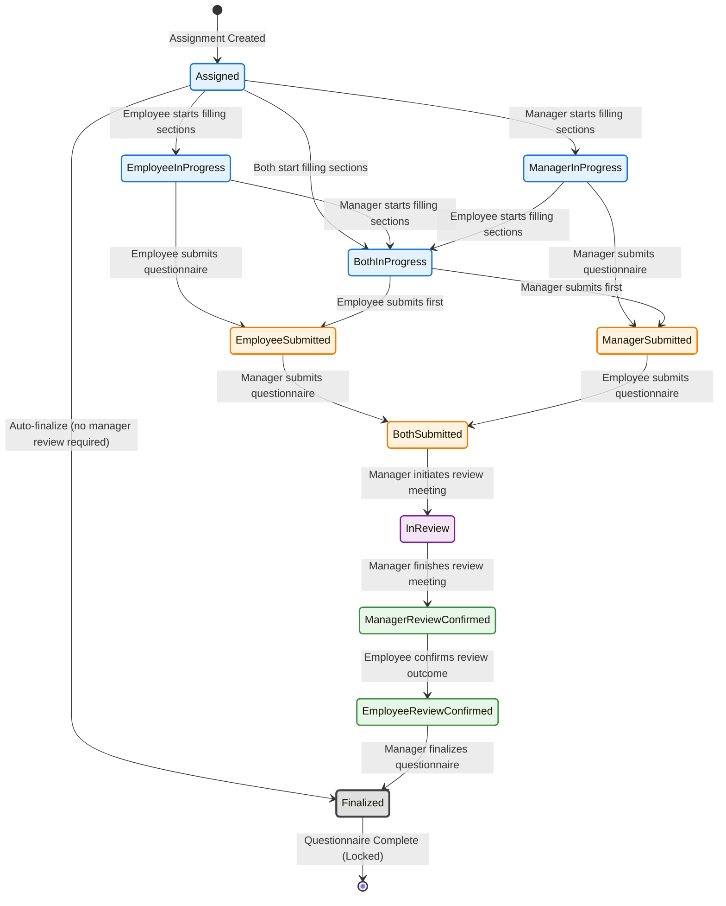

---

## 2. Workflow Phases Overview

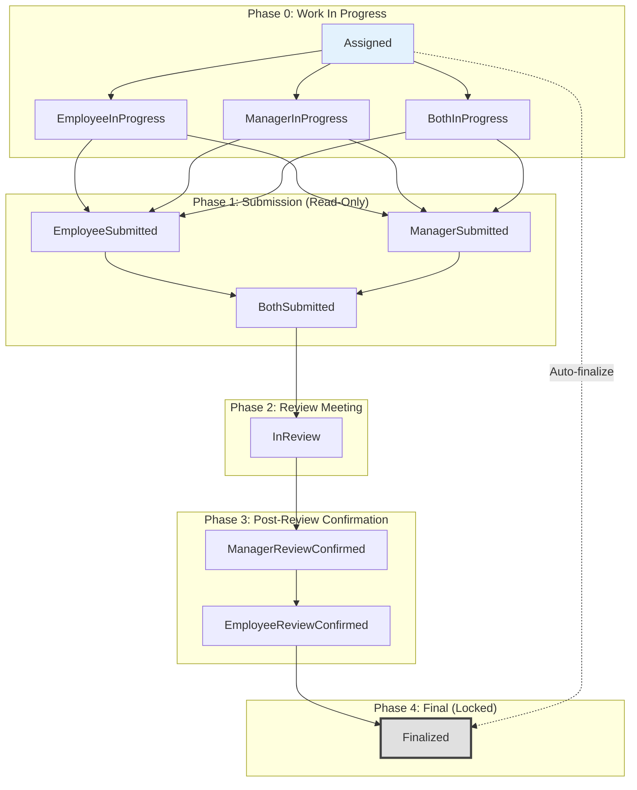

---

## 3. Actor Permissions by State

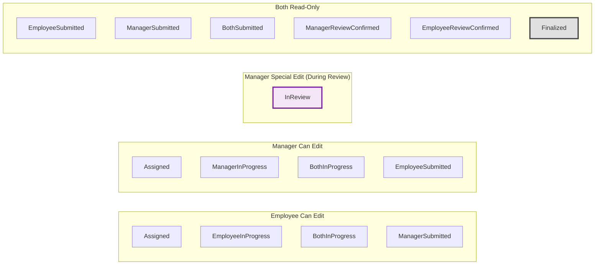

---

## 4. Detailed State Characteristics Table

| State | Employee Can Edit? | Manager Can Edit? | Read-Only? | Can Submit? | Special Notes |
|-------|-------------------|-------------------|------------|-------------|---------------|
| **Assigned** | ✅ Yes | ✅ Yes | ❌ No | ❌ No | Initial state, no progress yet |
| **EmployeeInProgress** | ✅ Yes | ❌ No | ❌ No | ✅ Employee | Employee has started, manager hasn't |
| **ManagerInProgress** | ❌ No | ✅ Yes | ❌ No | ✅ Manager | Manager has started, employee hasn't |
| **BothInProgress** | ✅ Yes | ✅ Yes | ❌ No | ✅ Both | Both parties actively working |
| **EmployeeSubmitted** | ❌ No | ✅ Yes | ⚠️ Partial | ✅ Manager | Employee locked, manager can continue |
| **ManagerSubmitted** | ✅ Yes | ❌ No | ⚠️ Partial | ✅ Employee | Manager locked, employee can continue |
| **BothSubmitted** | ❌ No | ❌ No | ✅ Yes | ❌ No | Waiting for review initiation |
| **InReview** | ❌ No | ✅ Yes (All sections) | ⚠️ Partial | ❌ No | Manager-led review meeting in progress |
| **ManagerReviewConfirmed** | ❌ No | ❌ No | ✅ Yes | ❌ No | Waiting for employee confirmation |
| **EmployeeReviewConfirmed** | ❌ No | ❌ No | ✅ Yes | ❌ No | Waiting for manager finalization |
| **Finalized** | ❌ No | ❌ No | ✅ Yes | ❌ No | **Terminal state - Permanently locked** |

---

## 5. State Transition Rules Matrix

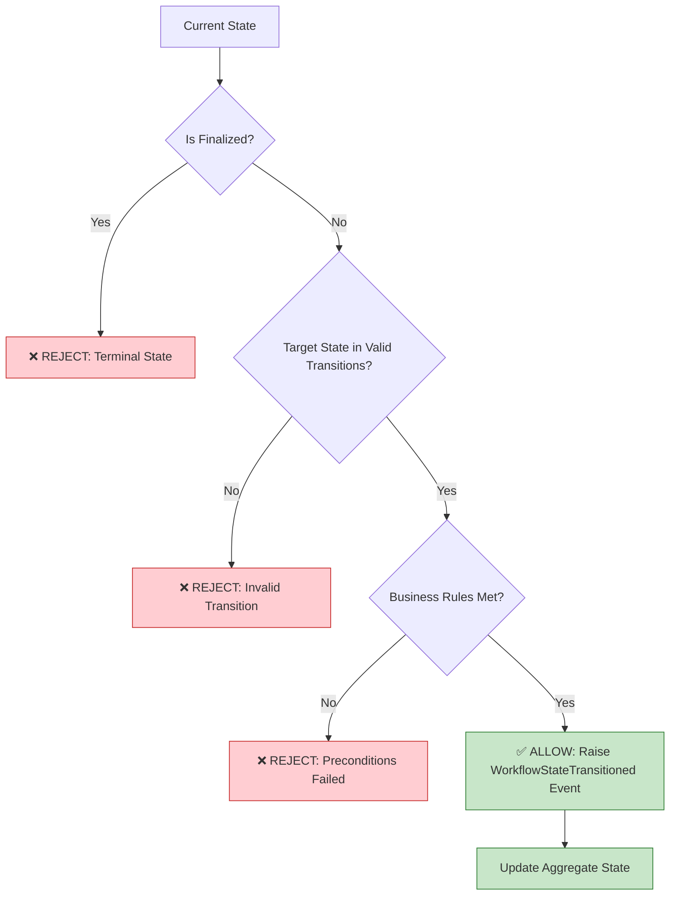

---

## 6. Section Completion Flow (Triggers State Changes)

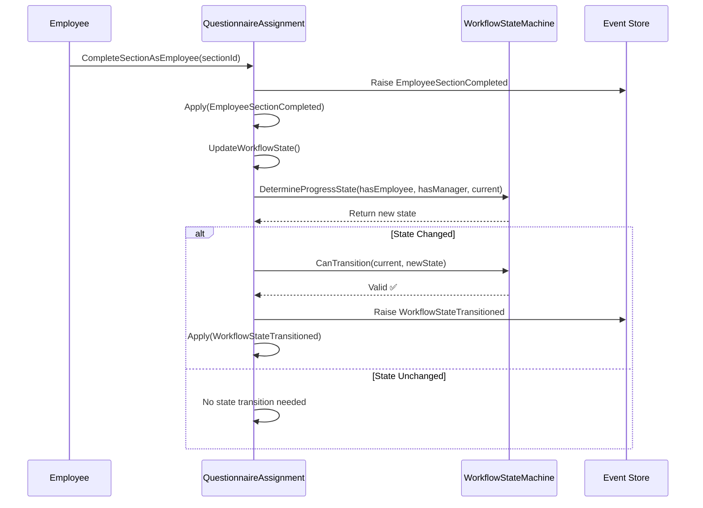

---

## 7. Submission Flow (Both Parties)

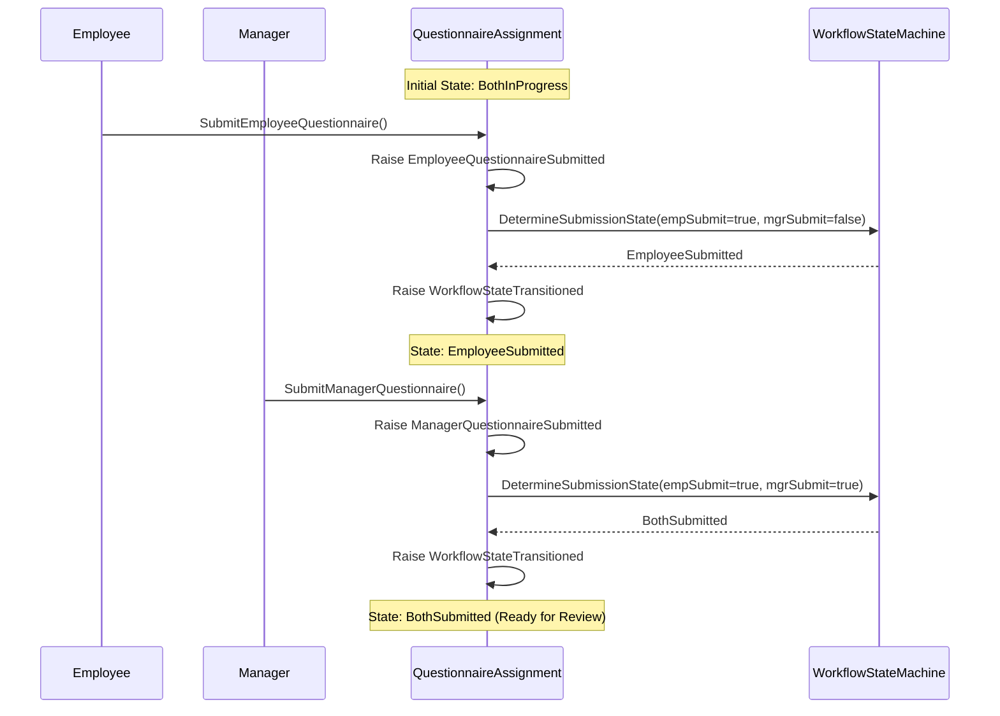

---

## 8. Review Meeting Flow

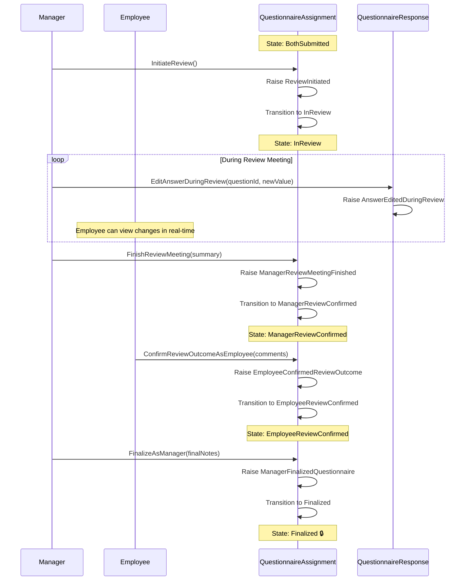

---

## 9. Auto-Finalization Flow (No Manager Review Required)

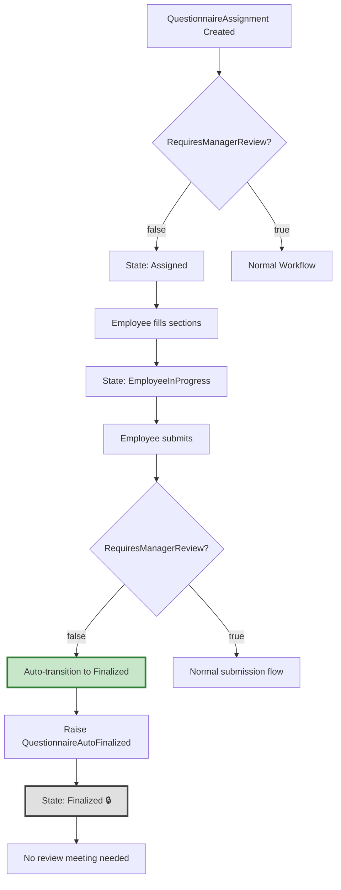

---

## 10. Invalid Transition Examples (Will Throw Exceptions)

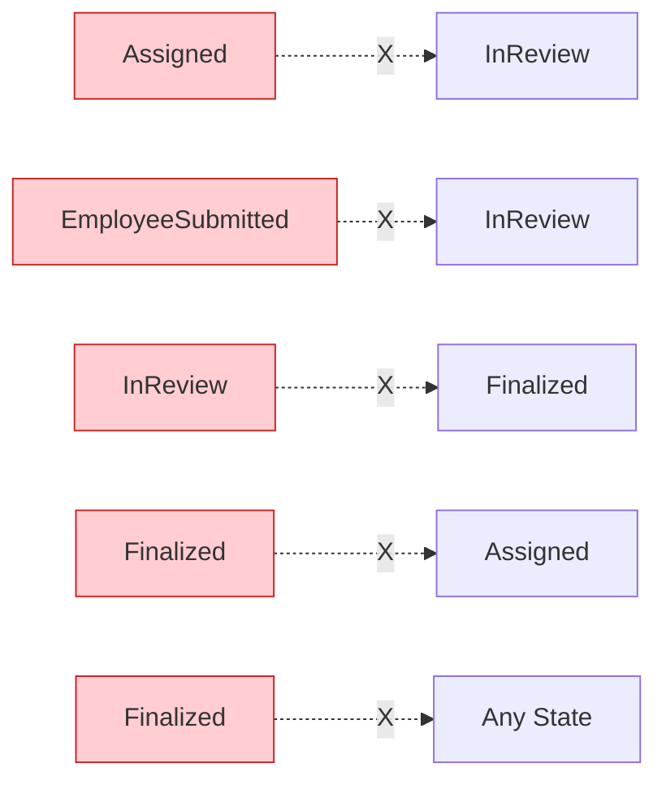

**Examples of Invalid Transitions:**
- ❌ `Assigned` → `InReview` (Must go through submission phase)
- ❌ `EmployeeSubmitted` → `InReview` (Manager must also submit)
- ❌ `InReview` → `Finalized` (Must confirm with employee)
- ❌ `Finalized` → `Assigned` (Terminal state, cannot revert)
- ❌ `Finalized` → `Any State` (Locked forever)

---

## 11. State Machine Implementation Architecture

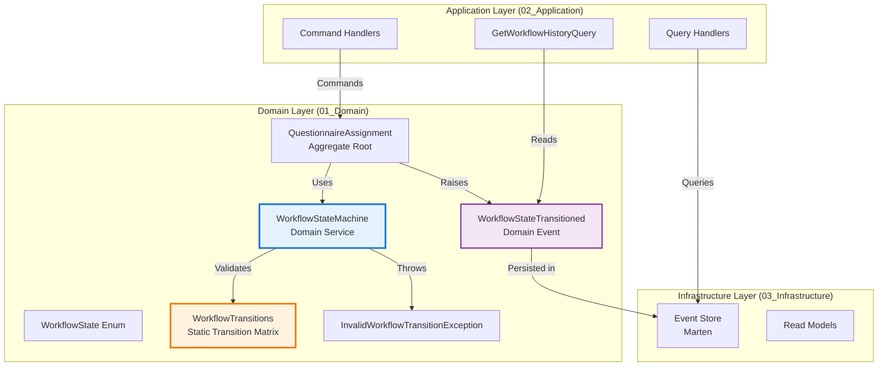

---

## 12. Key Business Rules Summary

### 🔵 Work Phase (Assigned → BothInProgress)
- Employee and Manager can work independently or simultaneously
- Completing sections transitions state automatically
- No explicit submission required in this phase

### 🟠 Submission Phase (EmployeeSubmitted → BothSubmitted)
- Once submitted, that party's answers are locked (Phase 1 Read-Only)
- Other party can continue working
- Both must submit before review can begin

### 🟣 Review Phase (InReview)
- Manager-led meeting
- Manager has elevated permissions (can edit all sections)
- Employee has read-only access during review
- Changes are tracked via `AnswerEditedDuringReview` events

### 🟢 Confirmation Phase (ManagerReviewConfirmed → EmployeeReviewConfirmed)
- Manager finishes first, provides summary
- Employee reviews and confirms
- Both parties acknowledge review outcome

### ⚫ Final Phase (Finalized)
- **Terminal State** - No transitions allowed
- Permanently locked
- Complete audit trail preserved

---

## 13. State Machine Validation Flow

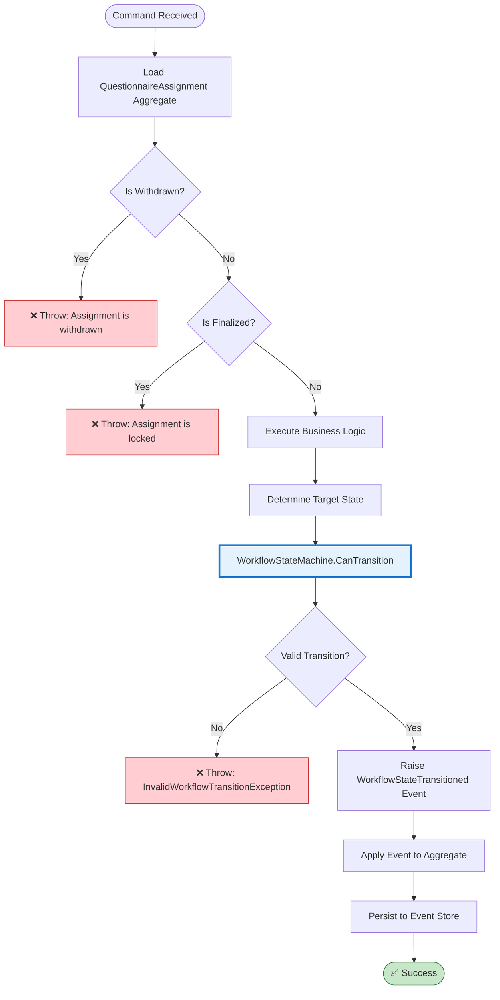

---

## 14. Testing Strategy Matrix

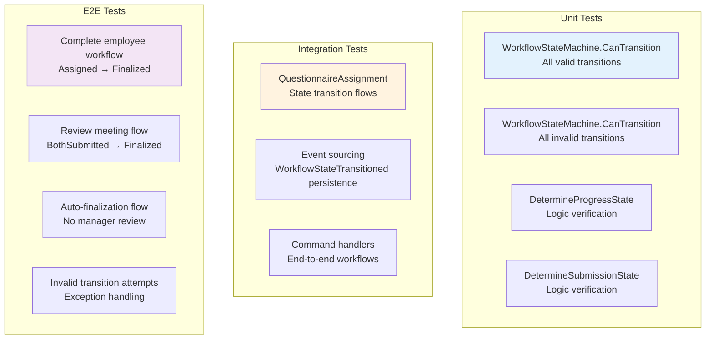

---

## 15. Transition Validation Rules (Detailed)

| From State | To State | Validation Rules | Can Fail? |
|------------|----------|------------------|-----------|
| **Assigned** | EmployeeInProgress | Employee completes at least 1 section | ✅ Yes (no sections) |
| **Assigned** | ManagerInProgress | Manager completes at least 1 section | ✅ Yes (no sections) |
| **Assigned** | BothInProgress | Both complete sections | ✅ Yes (not both) |
| **Assigned** | Finalized | `RequiresManagerReview == false` | ✅ Yes (requires review) |
| **EmployeeInProgress** | BothInProgress | Manager starts filling | ❌ No (automatic) |
| **EmployeeInProgress** | EmployeeSubmitted | Employee explicitly submits | ✅ Yes (validation fails) |
| **BothSubmitted** | InReview | Manager initiates review | ✅ Yes (not manager) |
| **InReview** | ManagerReviewConfirmed | Manager finishes meeting | ✅ Yes (validation fails) |
| **ManagerReviewConfirmed** | EmployeeReviewConfirmed | Employee confirms | ✅ Yes (not employee) |
| **EmployeeReviewConfirmed** | Finalized | Manager finalizes | ✅ Yes (not manager) |
| **Finalized** | Any | **Never allowed** | ❌ Always fails |

---

## 16. Event Sourcing Event Flow

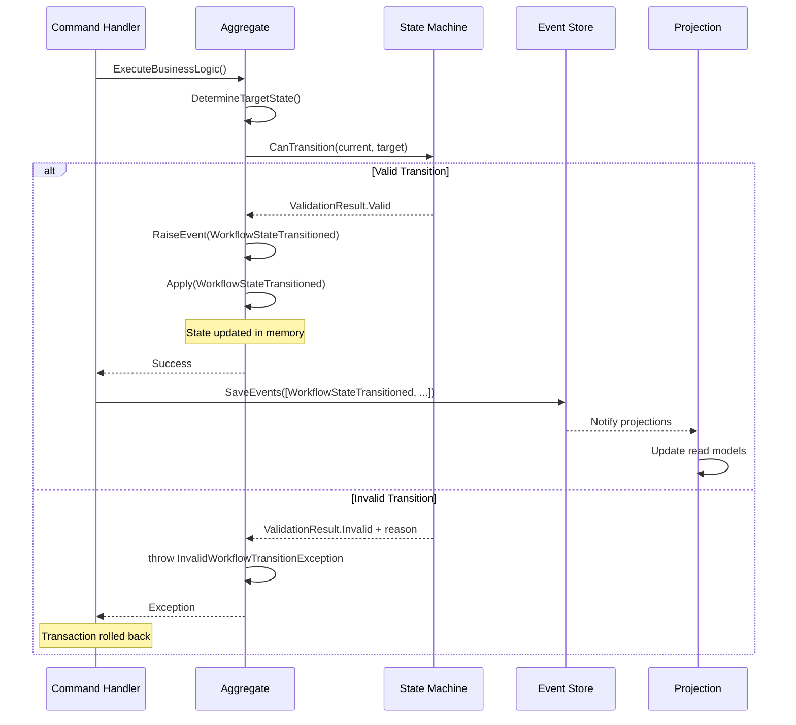

---

## 17. Performance Considerations

### State Machine Validation Performance
- ✅ **Dictionary lookups** - O(1) complexity
- ✅ **In-memory validation** - No database calls
- ✅ **Fail-fast design** - Exceptions thrown immediately
- ✅ **Zero external dependencies** - Pure domain logic

### Event Store Impact
- ⚠️ **New event type** `WorkflowStateTransitioned` adds ~1KB per transition
- ✅ **Event count** - Average 10-15 transitions per questionnaire lifecycle
- ✅ **Query optimization** - Can index on AssignmentId for history queries
- ✅ **Projection updates** - Read models updated asynchronously

---

## 18. Migration Strategy

### Existing Questionnaires Without WorkflowStateTransitioned Events

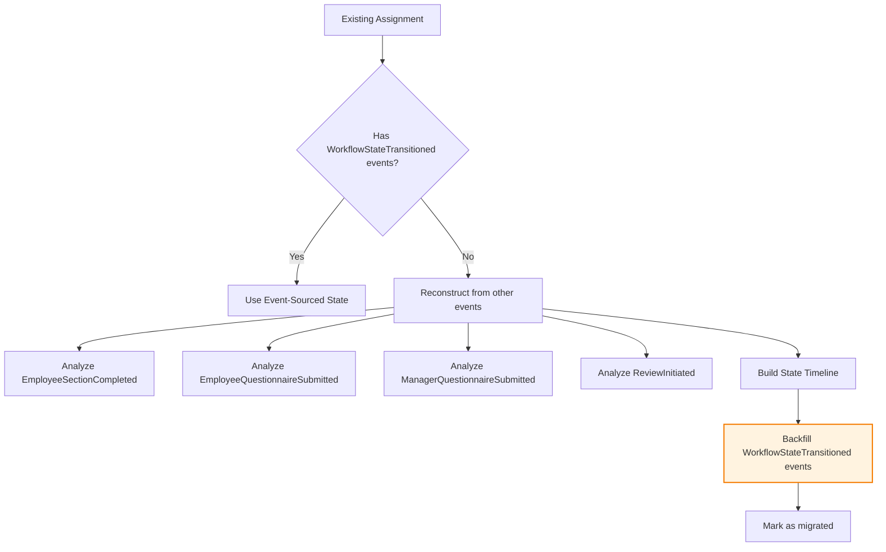

---

## 19. Backward Transitions (Reopen Functionality)

### Overview
Certain states can be reopened to allow corrections before finalization. Reopening requires special permissions and is tracked for audit purposes.

### Authorization Rules
- **Admin**: Can reopen ALL non-finalized states
- **HR**: Can reopen ALL non-finalized states
- **TeamLead**: Can reopen ALL non-finalized states for their team members (includes review states)
- **Finalized state CANNOT be reopened** - must create new assignment

### Reopen State Diagram

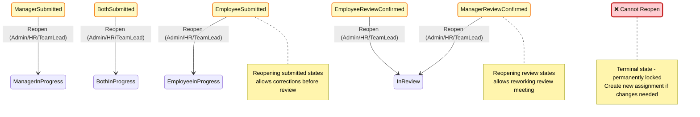

### Reopenable States Table

| From State | To State | Allowed Roles | Reason |
|------------|----------|---------------|---------|
| **EmployeeSubmitted** | EmployeeInProgress | Admin, HR, TeamLead | Employee questionnaire corrections |
| **ManagerSubmitted** | ManagerInProgress | Admin, HR, TeamLead | Manager questionnaire corrections |
| **BothSubmitted** | BothInProgress | Admin, HR, TeamLead | Both questionnaires need corrections |
| **ManagerReviewConfirmed** | InReview | Admin, HR, TeamLead | Rework review meeting (manager) |
| **EmployeeReviewConfirmed** | InReview | Admin, HR, TeamLead | Rework review meeting (after employee confirmation) |
| **Finalized** | N/A | ❌ None | Terminal state - cannot reopen |

### Reopen Command Flow

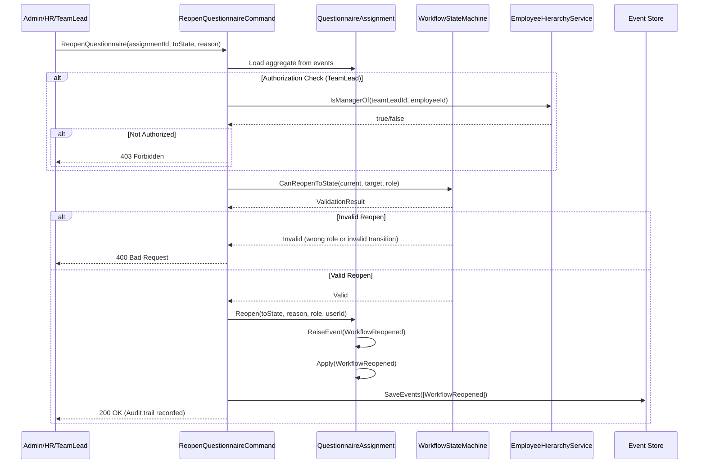

### Reopen Audit Trail

Every reopen action is tracked with:
- **LastReopenedDate**: When the reopen occurred
- **LastReopenedByEmployeeId**: Who performed the reopen
- **LastReopenedByRole**: Which role was used (Admin/HR/TeamLead)
- **LastReopenReason**: Why the questionnaire was reopened

### Business Rules for Reopening

1. **Data Scoping for TeamLead**:
   - TeamLead can ONLY reopen assignments for their direct reports
   - Checked via `EmployeeHierarchyService.IsManagerOf()`
   - Fail-closed security: On error, deny access

2. **State Resets on Reopen**:
   - Reopening to `EmployeeInProgress` clears employee submission flags
   - Reopening to `ManagerInProgress` clears manager submission flags
   - Reopening to `BothInProgress` clears both submission flags
   - Reopening to `InReview` clears review confirmation flags

3. **Terminal State Protection**:
   - `Finalized` state cannot be reopened under any circumstances
   - If changes needed after finalization, create a new assignment

### Example Use Cases

**Use Case 1: Correct Employee Answer Before Review**
```
State: EmployeeSubmitted
Action: TeamLead notices error in employee's self-assessment
Result: Reopen to EmployeeInProgress, employee fixes answer, resubmits
```

**Use Case 2: Rework Review Meeting**
```
State: ManagerReviewConfirmed
Action: TeamLead realizes they need to add more feedback
Result: Reopen to InReview, TeamLead edits responses, finishes review again
```

**Use Case 3: Post-Employee Confirmation Adjustment**
```
State: EmployeeReviewConfirmed
Action: HR discovers compliance issue during final review
Result: Reopen to InReview, manager addresses issue, completes flow again
```

---

## Summary Statistics

### Workflow Complexity Metrics
- **Total States**: 13
- **Terminal States**: 1 (Finalized)
- **Phases**: 5 (Work, Submission, Review, Confirmation, Final)
- **Total Possible Transitions**: 15
- **Average Transitions to Complete**: 8-10
- **Max Path Length**: 10 transitions (Assigned → Finalized with review)
- **Min Path Length**: 1 transition (Assigned → Finalized via auto-finalize)

### State Machine Benefits
- ✅ **Type Safety**: Compile-time guarantees
- ✅ **Testability**: Isolated validation logic
- ✅ **Maintainability**: Centralized transition rules
- ✅ **Auditability**: Complete transition history
- ✅ **Documentation**: Self-documenting code
- ✅ **Extensibility**: Easy to add new states/transitions

---

## Next Steps

1. ✅ **Review this documentation** with stakeholders
2. ⏳ **Implement Phase 1**: State Machine Foundation
3. ⏳ **Write comprehensive tests**
4. ⏳ **Migrate existing assignments**
5. ⏳ **Deploy to staging**
6. ⏳ **Monitor transition events**
7. ⏳ **Implement advanced features** (history queries, visualization)

---

**Document Version**: 1.1
**Last Updated**: 2025-10-25
**Author**: Claude Code (Senior Software Architect)
**Status**: Ready for Implementation ✅
**Recent Changes**: Added Section 19 documenting reopen functionality with TeamLead authorization for review states
