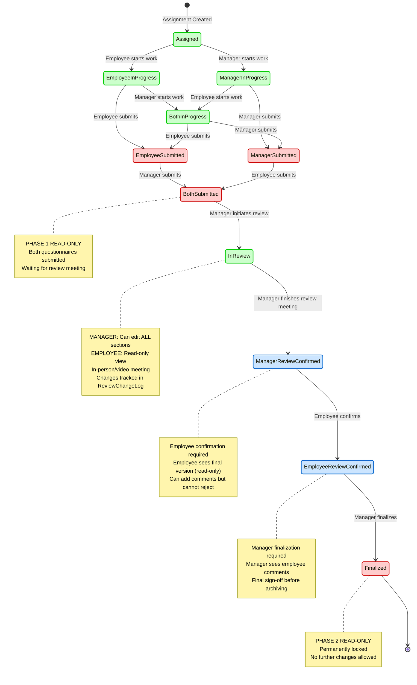

# Questionnaire Workflow State Diagram

## State Descriptions

### Initial States
- **Assigned**: Questionnaire assigned to employee, both parties can start

### Work In Progress States (Editable)
- **EmployeeInProgress**: Employee has started working on their sections
- **ManagerInProgress**: Manager has started working on their sections
- **BothInProgress**: Both employee and manager are working on their respective sections

### Submission States (Phase 1 Read-Only)
- **EmployeeSubmitted**: Employee has submitted their questionnaire, waiting for manager
- **ManagerSubmitted**: Manager has submitted their questionnaire, waiting for employee
- **BothSubmitted**: Both parties have submitted, ready for review meeting

### Review States
- **InReview**: Review meeting in progress - Manager can edit ALL sections, Employee has read-only access
- **ManagerReviewConfirmed**: Manager finished review meeting, waiting for employee confirmation
- **EmployeeReviewConfirmed**: Employee confirmed review outcome with optional comments, waiting for manager finalization

### Final State (Phase 2 Read-Only - Permanent)
- **Finalized**: Questionnaire finalized and permanently locked by manager

## Actions by State

| State | Employee Actions | Manager Actions |
|-------|------------------|-----------------|
| Assigned | Start working on sections | Start working on sections |
| EmployeeInProgress | Complete sections, Submit | Start working on sections |
| ManagerInProgress | Start working on sections | Complete sections, Submit |
| BothInProgress | Complete sections, Submit | Complete sections, Submit |
| EmployeeSubmitted | ❌ Wait for manager | Complete sections, Submit |
| ManagerSubmitted | Complete sections, Submit | ❌ Wait for employee |
| BothSubmitted | ❌ Wait for review | Initiate Review Meeting |
| InReview | ❌ Read-only view | Edit ALL sections, Finish Review |
| ManagerReviewConfirmed | Confirm with comments | ❌ Wait for employee |
| EmployeeReviewConfirmed | ❌ Wait for finalization | Finalize with notes |
| Finalized | ❌ Read-only | ❌ Read-only |

## Read-Only Phases

### Phase 1 Read-Only (Temporary)
Occurs after submission, before review meeting:
- `EmployeeSubmitted`
- `ManagerSubmitted`
- `BothSubmitted`

**Purpose**: Lock questionnaire for review preparation, ensure no changes before meeting

**Recovery**: Manager initiates review → transitions to `InReview` → editing allowed again

### Phase 2 Read-Only (Permanent)
Occurs after finalization:
- `Finalized`

**Purpose**: Permanent archive of performance review, no changes allowed

**Recovery**: None - this is the final state

## Key Workflow Features

1. **Parallel Completion**: Employee and manager can work independently on their sections
2. **Manager-Led Review**: During `InReview`, manager can edit ALL sections while employee has read-only access
3. **Review Changes Tracking**: All edits during review are logged in dedicated ReviewChangeLog projection
4. **Employee Confirmation**: Employee must confirm review outcome (can add comments, cannot reject)
5. **Manager Finalization**: Manager has final sign-off after seeing employee comments
6. **"Both" Sections**: Displayed side-by-side with copy buttons for quick alignment
7. **Two-Phase Read-Only**: Temporary read-only before review, permanent read-only after finalization
