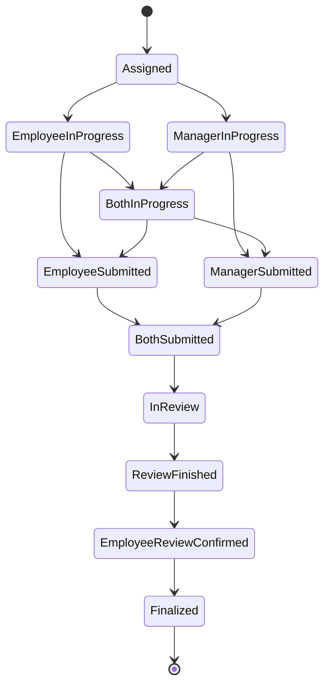

# Questionnaire Section Visibility Business Rules

**Status**: Implemented
**Last Updated**: 2025-10-29
**Related Documents**:
- [WorkflowDiagram.md](../../WorkflowDiagram.md)
- [questionnaire_workflow.md](../../questionnaire_workflow.md)

---

## Overview

This document defines the business rules for **section visibility** and **response filtering** in the questionnaire system. The rules ensure proper data access control throughout the questionnaire lifecycle, from initial assignment through final review and archival.

## Core Concepts

### Section CompletionRole

Each questionnaire section is assigned to one of three completion roles:

- **Employee** (`CompletionRole.Employee`): Only the employee can complete this section
- **Manager** (`CompletionRole.Manager`): Only the manager can complete this section
- **Both** (`CompletionRole.Both`): Both employee and manager complete this section independently

### Response Roles

Within "Both" sections, responses are stored separately by role:

- **Employee Response** (`ResponseRole.Employee`): The employee's answers in a Both section
- **Manager Response** (`ResponseRole.Manager`): The manager's answers in a Both section

This dual-response structure enables side-by-side comparison during review meetings.

---

## Section Visibility Rules by Workflow State

### 1. In-Progress States
**States**: `Assigned`, `EmployeeInProgress`, `ManagerInProgress`, `BothInProgress`

**Employee sees:**
- ✅ Sections with `CompletionRole.Employee`
- ✅ Sections with `CompletionRole.Both` (but only their own Employee responses)
- ❌ Sections with `CompletionRole.Manager`

**Manager sees:**
- ✅ Sections with `CompletionRole.Manager`
- ✅ Sections with `CompletionRole.Both` (but only their own Manager responses)
- ❌ Sections with `CompletionRole.Employee`

**Purpose**: Each party works independently on their assigned sections without seeing the other party's private responses.

---

### 2. Submitted States
**States**: `EmployeeSubmitted`, `ManagerSubmitted`, `BothSubmitted`

**Rules**: Same as In-Progress states (read-only mode)

**Employee sees:**
- ✅ Sections with `CompletionRole.Employee` (read-only)
- ✅ Sections with `CompletionRole.Both` (read-only, only their own Employee responses)
- ❌ Sections with `CompletionRole.Manager`

**Manager sees:**
- ✅ Sections with `CompletionRole.Manager` (read-only)
- ✅ Sections with `CompletionRole.Both` (read-only, only their own Manager responses)
- ❌ Sections with `CompletionRole.Employee`

**Purpose**: Phase 1 Read-Only - Lock questionnaire for review preparation, ensure no changes before meeting.

---

### 3. InReview State
**State**: `InReview`

**Employee sees:**
- ✅ Sections with `CompletionRole.Employee` (read-only)
- ✅ Sections with `CompletionRole.Both` (read-only, only their own Employee responses)
- ❌ Sections with `CompletionRole.Manager`

**Manager sees:**
- ✅ **ALL sections with ALL responses** (editable)
- ✅ Can view both Employee and Manager responses in Both sections
- ✅ Can edit any section during review meeting

**Purpose**: During in-person/video review meeting, manager conducts review with full visibility and editing capability. Employee participates but cannot edit.

---

### 4. Post-Review Confirmation States
**States**: `ReviewFinished`, `EmployeeReviewConfirmed`

**ReviewFinished State:**
- **Employee**: Can view ALL sections (read-only) and edit comments during sign-off
- **Manager**: Can view ALL sections (read-only), waiting for employee sign-off

**EmployeeReviewConfirmed State:**
- **Both Employee and Manager**: Can view ALL sections with ALL responses (read-only)
- ✅ Full transparency after employee sign-off
- ✅ Both parties can see Employee and Manager responses in Both sections

**Purpose**: Employee signs off on review outcome (can edit comments). Manager sees employee comments and can finalize.

---

### 5. Finalized State
**State**: `Finalized`

**Both Employee and Manager see:**
- ✅ **ALL sections with ALL responses** (read-only, permanent)

**Purpose**: Phase 2 Read-Only - Permanent archive of performance review. No changes allowed.

---

## Implementation Architecture

### Frontend Filtering
**File**: `05_Frontend/ti8m.BeachBreak.Client/Pages/DynamicQuestionnaire.razor`
**Method**: `FilterVisibleSections()`

**Responsibility**: Filter which sections are displayed to the user based on:
- User's role (Employee vs Manager)
- Assignment's workflow state
- Section's CompletionRole

**Logic**:
```csharp
// Post-review states: Show all sections
if (state is ReviewFinished or EmployeeReviewConfirmed or Finalized)
    return ALL sections;

// InReview: Manager sees all, Employee sees their sections
if (state == InReview)
{
    if (isManager) return ALL sections;
    else return Employee + Both sections;
}

// In-Progress + Submitted: Role-based filtering
if (isManager) return Manager + Both sections;
else return Employee + Both sections;
```

---

### Backend Filtering
**File**: `03_Infrastructure/ti8m.BeachBreak.QueryApi/Controllers/ResponsesController.cs`
**Method**: `FilterSectionsByUserRoleAndWorkflowState()`

**Responsibility**: Filter response data before sending over the network to prevent:
- Data leakage via network inspection
- Unauthorized access to responses

**Logic**:
1. Determine current user's ApplicationRole (via UserContext)
2. Fetch questionnaire template to check section CompletionRoles
3. Filter sections based on user role and workflow state
4. Filter responses within "Both" sections:
   - Employees see only their Employee responses
   - Managers see only their Manager responses
   - Exception: InReview state - Manager sees all responses
   - Exception: Post-review states - Both see all responses

**Defense in Depth**: Both frontend and backend enforce the same rules. Backend filtering is the security boundary.

---

## Security Considerations

### 1. Backend Enforcement is Critical
- Frontend filtering is for UX only
- Backend MUST filter data before transmission
- Network traffic inspection should reveal only authorized data

### 2. Both Section Response Isolation
During In-Progress and Submitted states:
- Employee's Both section responses MUST NOT be visible to Manager
- Manager's Both section responses MUST NOT be visible to Employee
- Backend filters `RoleResponses` dictionary to include only the user's role

### 3. InReview State Exception
- Manager needs full visibility to conduct meaningful review
- This is an explicit business requirement, not a security flaw
- Employee is present (video/in-person) during InReview state

### 4. Audit Trail
All workflow state transitions and review changes are logged for compliance and accountability.

---

## Workflow State Reference



For complete workflow details, see [WorkflowDiagram.md](../../WorkflowDiagram.md).

---

## Testing Scenarios

### Test 1: Manager Viewing During EmployeeInProgress
**Setup**:
- Assignment in `EmployeeInProgress` state
- Template has 3 sections: Section 1 (Both), Section 2 (Employee), Section 3 (Manager)

**Expected Result**:
- Manager sees: Section 1 (Both), Section 3 (Manager)
- Manager does NOT see: Section 2 (Employee)
- In Section 1, Manager sees only their own Manager responses (if any)

### Test 2: Employee Viewing During InReview
**Setup**:
- Assignment in `InReview` state
- Both employee and manager have completed their sections

**Expected Result**:
- Employee sees: Section 1 (Both), Section 2 (Employee)
- Employee does NOT see: Section 3 (Manager)
- In Section 1, Employee sees only their own Employee responses
- All sections are read-only for Employee

### Test 3: Employee Sign-Off State
**Setup**:
- Assignment in `ReviewFinished` state
- Manager has finished review meeting

**Expected Result**:
- Both Employee and Manager see: ALL 3 sections
- In Section 1 (Both), both see Employee AND Manager responses
- All sections are read-only
- Employee can edit comments during sign-off process

---

## Related Enums

### ApplicationRole (Domain)
```csharp
public enum ApplicationRole
{
    Employee = 0,
    TeamLead = 1,  // Has manager privileges
    HR = 2,        // Has manager privileges
    HRLead = 3,    // Has manager privileges
    Admin = 4      // Has manager privileges
}
```

### CompletionRole (Domain)
```csharp
public enum CompletionRole
{
    Employee = 0,
    Manager = 1,
    Both = 2
}
```

### ResponseRole (DTOs)
```csharp
public enum ResponseRole
{
    Employee = 0,
    Manager = 1
}
```

### WorkflowState (Domain)
```csharp
public enum WorkflowState
{
    Assigned = 0,
    EmployeeInProgress = 1,
    ManagerInProgress = 2,
    BothInProgress = 3,
    EmployeeSubmitted = 4,
    ManagerSubmitted = 5,
    BothSubmitted = 6,
    InReview = 7,
    ReviewFinished = 8,
    EmployeeReviewConfirmed = 9,
    Finalized = 10
}
```

---

## Change History

| Date | Author | Change |
|------|--------|--------|
| 2025-01-04 | Claude Code | Simplified workflow states - Removed redundant AwaitingEmployeeSignOff state, fixed ReviewFinished implementation |
| 2025-10-29 | Claude Code | Initial documentation based on implemented business rules |

---

## Questions & Clarifications

If you have questions about these rules, please refer to:
1. This document for section visibility logic
2. [WorkflowDiagram.md](../../WorkflowDiagram.md) for state transitions
3. [questionnaire_workflow.md](../../questionnaire_workflow.md) for overall workflow description
