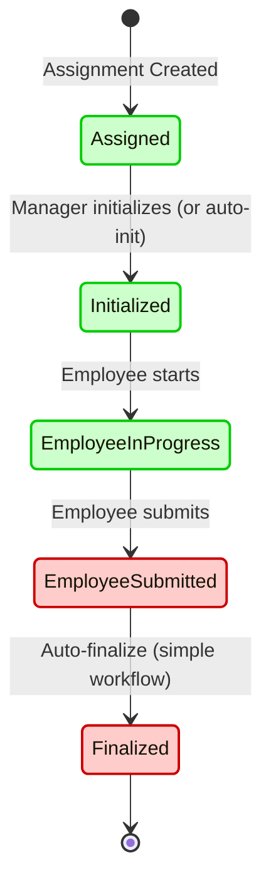
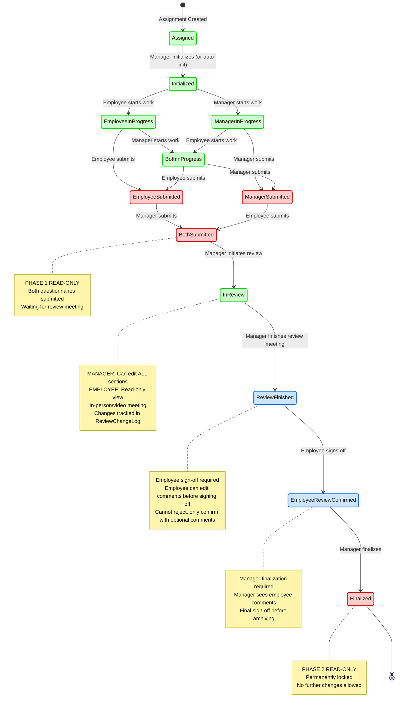

# Questionnaire Workflow Management

## Table of Contents
1. [Overview](#overview)
2. [Workflow States](#workflow-states)
3. [Process Types](#process-types)
4. [State Transition Rules](#state-transition-rules)
5. [Authorization Model](#authorization-model)
6. [Auto-Initialization Feature](#auto-initialization-feature)
7. [Workflow Phases](#workflow-phases)
8. [State Transition Diagrams](#state-transition-diagrams)
9. [Implementation Details](#implementation-details)
10. [Best Practices](#best-practices)

---

## Overview

The BeachBreak questionnaire system uses a sophisticated state machine to manage the lifecycle of questionnaire assignments from creation through finalization. The workflow supports both simple (employee-only) and complex (employee + manager) questionnaire types with optional review phases.

**Key Principles:**
- **Event-Sourced**: All state changes are tracked as domain events
- **Validation-First**: State transitions are validated before execution
- **Role-Based**: Different roles have different permissions at each state
- **Unidirectional Flow**: Generally moves forward, with limited backward transitions for corrections

## Workflow States

### Initialized Workflow State (Added 2026-01-06)

**Purpose**: The `Initialized` state represents a manager-only initialization phase between assignment creation and employee access. This allows managers to prepare the assignment with optional customizations before employees begin work.

**Workflow Sequence**:
1. **Assigned** (value=0) - Assignment created, manager-only access
2. **Initialized** (value=1) - Manager completed initialization, both can access
3. **EmployeeInProgress** / **ManagerInProgress** / **BothInProgress** (values=2-4)
4. Continue through existing workflow states (5-11)

**Key Features**:
- **Manager Initialization Tasks** (all optional):
  - Link predecessor questionnaire for goal tracking
  - Add custom Assessment or TextQuestion sections (`IsInstanceSpecific = true`)
  - Add initialization notes for employee (max 5000 characters)
- **Access Control**:
  - Employees CANNOT see assignments in `Assigned` state
  - Employees CAN see and work on assignments in `Initialized+` states
  - Only managers (TeamLead/HR/HRLead/Admin) can initialize

**Custom Sections**:
- Marked with `IsInstanceSpecific = true`
- Created during manager initialization (Assigned state only)
- Appear seamlessly with template sections in UI
- **Excluded from aggregate reports** (instance-specific, not comparable across assignments)
- Cannot add Goal-type custom sections (created dynamically during workflow)

### State Enum Definition

```csharp
public enum WorkflowState
{
    Assigned = 0,           // Initial state - manager preparation phase
    Initialized = 1,        // Manager completed initialization
    EmployeeInProgress = 2, // Employee filling questionnaire
    ManagerInProgress = 3,  // Manager filling questionnaire
    BothInProgress = 4,     // Both employee and manager filling

    // Submission Phase (Read-Only)
    EmployeeSubmitted = 5,  // Employee completed and submitted
    ManagerSubmitted = 6,   // Manager completed and submitted
    BothSubmitted = 7,      // Both submitted, awaiting review

    // Review Phase
    InReview = 8,           // Manager-led review meeting

    // Post-Review Confirmation
    ReviewFinished = 9,         // Manager finished review, awaiting employee confirmation
    EmployeeReviewConfirmed = 10, // Employee confirmed review outcome

    // Final State (Read-Only)
    Finalized = 11          // Terminal state - questionnaire archived
}
```

### Detailed State Descriptions

#### 1. **Assigned** (Value: 0)
- **Purpose**: Manager-only preparation phase
- **Duration**: From creation until manager completes initialization
- **Manager Actions**:
  - Link predecessor questionnaire for goal tracking
  - Add custom sections (if `IsCustomizable=true`)
  - Add initialization notes for employee
- **Employee Visibility**: ❌ **NOT visible to employees**
- **Can Edit**: ✅ Manager only
- **Next States**: `Initialized`

#### 2. **Initialized** (Value: 1)
- **Purpose**: Manager completed initialization, both parties can begin work
- **Duration**: From initialization until first party starts filling
- **Manager Actions**: Can start filling their questionnaire
- **Employee Actions**: Can start filling their questionnaire
- **Employee Visibility**: ✅ **Visible to employees**
- **Can Edit**: ✅ Both employee and manager
- **Next States**: `EmployeeInProgress`, `ManagerInProgress`, `BothInProgress`

#### 3. **EmployeeInProgress** (Value: 2)
- **Purpose**: Employee actively filling questionnaire, manager not started
- **Manager Actions**: Can start filling (transitions to `BothInProgress`)
- **Employee Actions**: Can continue filling, can submit when complete
- **Can Edit**: ✅ Employee (✅ Manager can also start)
- **Next States**: `BothInProgress`, `EmployeeSubmitted`

#### 4. **ManagerInProgress** (Value: 3)
- **Purpose**: Manager actively filling questionnaire, employee not started
- **Manager Actions**: Can continue filling, can submit when complete
- **Employee Actions**: Can start filling (transitions to `BothInProgress`)
- **Can Edit**: ✅ Manager (✅ Employee can also start)
- **Next States**: `BothInProgress`, `ManagerSubmitted`

#### 5. **BothInProgress** (Value: 4)
- **Purpose**: Both employee and manager actively filling questionnaires
- **Manager Actions**: Can continue filling, can submit when complete
- **Employee Actions**: Can continue filling, can submit when complete
- **Can Edit**: ✅ Both
- **Next States**: `EmployeeSubmitted`, `ManagerSubmitted`

#### 6. **EmployeeSubmitted** (Value: 5)
- **Purpose**: Employee completed and submitted, awaiting manager
- **Manager Actions**: Can continue filling, can submit when complete
- **Employee Actions**: None (read-only)
- **Can Edit**: ✅ Manager only (employee's questionnaire is locked)
- **Next States**: `BothSubmitted`, `Finalized` (if no manager review required)
- **Special Case**: If `RequiresManagerReview=false`, auto-transitions to `Finalized`

#### 7. **ManagerSubmitted** (Value: 6)
- **Purpose**: Manager completed and submitted, awaiting employee
- **Manager Actions**: None (read-only)
- **Employee Actions**: Can continue filling, can submit when complete
- **Can Edit**: ✅ Employee only (manager's questionnaire is locked)
- **Next States**: `BothSubmitted`

#### 8. **BothSubmitted** (Value: 7)
- **Purpose**: Both parties submitted, ready for review meeting
- **Manager Actions**: Can initiate review meeting
- **Employee Actions**: None (read-only)
- **Can Edit**: ❌ Both questionnaires locked
- **Next States**: `InReview`

#### 9. **InReview** (Value: 8)
- **Purpose**: Manager-led review meeting in progress
- **Duration**: From review initiation until manager finishes review
- **Manager Actions**:
  - Can edit answers (with audit trail)
  - Can add/edit/delete discussion notes
  - Can finish review with summary
- **Employee Actions**:
  - Read-only view of questionnaires
  - Can add/edit/delete discussion notes
- **Can Edit**: ✅ Manager can edit answers, ✅ Both can manage notes
- **Next States**: `ReviewFinished`

#### 10. **ReviewFinished** (Value: 9)
- **Purpose**: Manager completed review, awaiting employee confirmation
- **Manager Actions**: None (waiting for employee)
- **Employee Actions**: Can confirm review outcome with optional comments
- **Can Edit**: ❌ Both questionnaires locked
- **Next States**: `EmployeeReviewConfirmed`

#### 11. **EmployeeReviewConfirmed** (Value: 10)
- **Purpose**: Employee confirmed review outcome, awaiting manager finalization
- **Manager Actions**: Can finalize with optional final notes
- **Employee Actions**: None (read-only)
- **Can Edit**: ❌ Both questionnaires locked
- **Next States**: `Finalized`

#### 12. **Finalized** (Value: 11)
- **Purpose**: Terminal state - questionnaire lifecycle complete
- **Manager Actions**: None (read-only)
- **Employee Actions**: None (read-only)
- **Can Edit**: ❌ Completely locked (archived)
- **Next States**: None (terminal state)

---

## Process Types

### Overview (Added 2026-01-15)

**Purpose**: The `QuestionnaireProcessType` enum defines different types of questionnaire processes, each with specific business rules that control three tightly coupled features: manager review requirements, allowed question types, and allowed completion roles.

**Available Process Types**:
1. **PerformanceReview** (value=0) - Traditional performance review with manager involvement
2. **Survey** (value=1) - Employee-only survey without manager review

### Business Rules by Process Type

| Feature | PerformanceReview | Survey |
|---------|------------------|--------|
| **Requires Manager Review** | Yes | No |
| **Allowed Question Types** | Assessment, TextQuestion, Goal, EmployeeFeedback | Assessment, TextQuestion only |
| **Allowed Completion Roles** | Employee, Manager, Both | Employee only |

### Key Characteristics

- **Type Safety**: Separate enum types in each layer (Domain, CommandApi, QueryApi, Frontend) to prevent coupling
- **Extension Methods**: Business logic encapsulated in `QuestionnaireProcessTypeExtensions`:
  - `RequiresManagerReview()` - Returns whether manager review is required
  - `IsQuestionTypeAllowed(QuestionType)` - Validates if a question type is allowed
  - `IsCompletionRoleAllowed(CompletionRole)` - Validates if a completion role is allowed
  - `GetAllowedQuestionTypes()` - Returns list of allowed question types
  - `GetAllowedCompletionRoles()` - Returns list of allowed completion roles

### UI Integration

- **Template Builder**: ProcessType dropdown in BasicInfoTab with icons and descriptions
- **Icons**: `assessment` (PerformanceReview), `poll` (Survey)
- **Badge Classes**: `badge-performance-review`, `badge-survey`
- **Helper**: `QuestionnaireProcessTypeHelper` provides UI-specific methods

---

## State Transition Rules

### Forward Transitions (Normal Flow)

```
Assigned → Initialized
    ├─ Trigger: Manager calls InitializeAssignment
    ├─ Required: Manager role (TeamLead/HR/HRLead/Admin)
    └─ Validation: Must be in Assigned state

Initialized → EmployeeInProgress | ManagerInProgress | BothInProgress
    ├─ Trigger: Employee or manager starts work (saves first response)
    ├─ Logic:
    │   └─ If employee starts → EmployeeInProgress
    │   └─ If manager starts → ManagerInProgress
    │   └─ If both start simultaneously → BothInProgress

EmployeeInProgress → BothInProgress
    ├─ Trigger: Manager starts work
    └─ Validation: Assignment not withdrawn

EmployeeInProgress → EmployeeSubmitted
    ├─ Trigger: Employee submits questionnaire
    └─ Validation: Employee questionnaire 100% complete

ManagerInProgress → BothInProgress
    ├─ Trigger: Employee starts work
    └─ Validation: Assignment not withdrawn

ManagerInProgress → ManagerSubmitted
    ├─ Trigger: Manager submits questionnaire
    └─ Validation: Manager questionnaire 100% complete

BothInProgress → EmployeeSubmitted
    ├─ Trigger: Employee submits first
    └─ Validation: Employee questionnaire 100% complete

BothInProgress → ManagerSubmitted
    ├─ Trigger: Manager submits first
    └─ Validation: Manager questionnaire 100% complete

EmployeeSubmitted → BothSubmitted
    ├─ Trigger: Manager submits
    └─ Validation: Manager questionnaire 100% complete

EmployeeSubmitted → Finalized (Auto-transition)
    ├─ Trigger: Employee submits AND RequiresManagerReview=false
    └─ Special: Skips entire review phase for simple questionnaires

ManagerSubmitted → BothSubmitted
    ├─ Trigger: Employee submits
    └─ Validation: Employee questionnaire 100% complete

BothSubmitted → InReview
    ├─ Trigger: Manager initiates review
    ├─ Required: Manager role
    └─ Validation: Both questionnaires 100% complete

InReview → ReviewFinished
    ├─ Trigger: Manager finishes review with summary
    ├─ Required: Manager role
    └─ Validation: Review summary provided

ReviewFinished → EmployeeReviewConfirmed
    ├─ Trigger: Employee confirms review outcome
    ├─ Required: Employee role
    └─ Validation: Must be assigned employee

EmployeeReviewConfirmed → Finalized
    ├─ Trigger: Manager finalizes with optional notes
    ├─ Required: Manager role
    └─ Validation: Employee has confirmed
```

### Backward Transitions (Reopening)

Backward transitions allow authorized users to reopen assignments for corrections. **Finalized state CANNOT be reopened.**

```
Initialized → Assigned
    ├─ Trigger: Admin/HR/TeamLead reopens to reset initialization
    ├─ Reason: "Reset initialization"
    └─ Allowed Roles: Admin, HR, TeamLead

EmployeeSubmitted → EmployeeInProgress
    ├─ Trigger: Admin/HR/TeamLead reopens for corrections
    ├─ Reason: "Employee questionnaire corrections"
    └─ Allowed Roles: Admin, HR, TeamLead

ManagerSubmitted → ManagerInProgress
    ├─ Trigger: Admin/HR/TeamLead reopens for corrections
    ├─ Reason: "Manager questionnaire corrections"
    └─ Allowed Roles: Admin, HR, TeamLead

BothSubmitted → BothInProgress
    ├─ Trigger: Admin/HR/TeamLead reopens for corrections
    ├─ Reason: "Both questionnaires corrections"
    └─ Allowed Roles: Admin, HR, TeamLead

ReviewFinished → InReview
    ├─ Trigger: Admin/HR/TeamLead reopens review meeting
    ├─ Reason: "Review meeting manager revisions"
    └─ Allowed Roles: Admin, HR, TeamLead

EmployeeReviewConfirmed → ReviewFinished
    ├─ Trigger: Admin/HR/TeamLead returns to employee signoff
    ├─ Reason: "Return to employee signoff"
    └─ Allowed Roles: Admin, HR, TeamLead

EmployeeReviewConfirmed → InReview
    ├─ Trigger: Admin/HR/TeamLead reopens review after confirmation
    ├─ Reason: "Review meeting after confirmation"
    └─ Allowed Roles: Admin, HR, TeamLead
```

**Important Rules:**
- Only specific roles can reopen assignments
- TeamLead can only reopen assignments for their own team members
- Reopening creates audit trail with reason
- Finalized state is **terminal** - no reopening allowed

---

## Authorization Model

### Role Hierarchy

```
Employee (0) < TeamLead (1) < HR (2) < HRLead (3) < Admin (4)
```

### Permissions by State

| State | Employee View | Employee Edit | Manager View | Manager Edit | Can Transition |
|-------|--------------|---------------|--------------|--------------|----------------|
| **Assigned** | ❌ No | ❌ No | ✅ Yes | ✅ Yes | Manager (init) |
| **Initialized** | ✅ Yes | ✅ Yes | ✅ Yes | ✅ Yes | Both (start) |
| **EmployeeInProgress** | ✅ Yes | ✅ Yes | ✅ Yes | ✅ Yes | Both |
| **ManagerInProgress** | ✅ Yes | ✅ Yes | ✅ Yes | ✅ Yes | Both |
| **BothInProgress** | ✅ Yes | ✅ Yes | ✅ Yes | ✅ Yes | Both |
| **EmployeeSubmitted** | ✅ Yes | ❌ No | ✅ Yes | ✅ Yes | Manager |
| **ManagerSubmitted** | ✅ Yes | ✅ Yes | ✅ Yes | ❌ No | Employee |
| **BothSubmitted** | ✅ Yes | ❌ No | ✅ Yes | ❌ No | Manager (review) |
| **InReview** | ✅ Yes | ❌ No* | ✅ Yes | ✅ Yes* | Manager (finish) |
| **ReviewFinished** | ✅ Yes | ❌ No | ✅ Yes | ❌ No | Employee (confirm) |
| **EmployeeReviewConfirmed** | ✅ Yes | ❌ No | ✅ Yes | ❌ No | Manager (finalize) |
| **Finalized** | ✅ Yes | ❌ No | ✅ Yes | ❌ No | None (terminal) |

*During InReview: Both can edit discussion notes, only manager can edit answers

### Reopen Permissions

| From State | To State | Allowed Roles |
|------------|----------|---------------|
| Initialized | Assigned | Admin, HR, TeamLead |
| EmployeeSubmitted | EmployeeInProgress | Admin, HR, TeamLead |
| ManagerSubmitted | ManagerInProgress | Admin, HR, TeamLead |
| BothSubmitted | BothInProgress | Admin, HR, TeamLead |
| ReviewFinished | InReview | Admin, HR, TeamLead |
| EmployeeReviewConfirmed | ReviewFinished | Admin, HR, TeamLead |
| EmployeeReviewConfirmed | InReview | Admin, HR, TeamLead |

---

## Auto-Initialization Feature

### Overview

Added: **2026-01-13**

The `AutoInitialize` flag on questionnaire templates controls whether assignments skip the manual initialization phase.

**Auto-Initialization (Added 2026-01-13)**:
- **AutoInitialize Flag**: Questionnaire templates have an `AutoInitialize` boolean property (default: `false`)
- **Purpose**: Controls whether assignments from this template skip the initialization phase
- **Separation of Concerns**: Independent from `IsCustomizable` flag
  - `IsCustomizable`: Can managers add custom sections to this template?
  - `AutoInitialize`: Should assignments skip the initialization phase?

### Valid Combinations

| IsCustomizable | AutoInitialize | Use Case | Behavior |
|----------------|----------------|----------|----------|
| `false` | `false` | Non-customizable but needs initialization | Manager must initialize (e.g., link predecessors, add notes) |
| `false` | `true` | Simple surveys | Auto-initialize, immediate employee access |
| `true` | `false` | Full customization workflow | Manager can add custom sections, must initialize |
| `true` | `true` | Customizable with auto-init | Manager can add custom sections, but auto-initialized |

### Auto-Initialization Behavior

**When `AutoInitialize = true`:**

1. **During Assignment Creation** (`CreateBulkAssignmentsCommandHandler`):
   ```csharp
   if (template.AutoInitialize && command.AssignedByEmployeeId.HasValue)
   {
       assignment.StartInitialization(
           command.AssignedByEmployeeId.Value,
           "Auto-initialized per template configuration");
   }
   ```

2. **State Flow**:
   ```
   Created → [Auto-Initialize] → Initialized → (ready for work)
   ```

**When `AutoInitialize = false`:**

1. **State Flow**:
   ```
   Created → Assigned → [Manager Initializes] → Initialized → (ready for work)
   ```

2. **Manager Actions**:
   - Navigate to `/assignments/{id}/initialize`
   - Optionally link predecessor questionnaire
   - Optionally add custom sections (if `IsCustomizable=true`)
   - Complete initialization

### Business Logic
- **UI Control**: Checkbox in Questionnaire Builder > Basic Info Tab (disabled when template is Published/Archived)
- **Business Logic**: `CreateBulkAssignmentsCommandHandler` checks `template.AutoInitialize` instead of `!template.IsCustomizable`
- **Translation Keys**: `templates.auto-initialize`, `templates.auto-initialize-tooltip`, `assignments.auto-initialized`

---

## Workflow Phases

### Phase 1: Initialization Phase
**States**: `Assigned`, `Initialized`

**Purpose**: Manager preparation before employee access

**Activities**:
- Link predecessor questionnaire for goal tracking
- Add custom Assessment or TextQuestion sections (if `IsCustomizable=true`)
- Add initialization notes for employee (max 5000 characters)

**Key Rule**: Employees **CANNOT** see assignments in `Assigned` state

### Phase 2: Working Phase
**States**: `EmployeeInProgress`, `ManagerInProgress`, `BothInProgress`

**Purpose**: Both parties fill their respective questionnaires

**Activities**:
- Employee completes competency assessments, text responses, goal setting
- Manager completes assessments, evaluations, feedback
- Both can save partial progress (draft mode)

**Completion Validation**:
- All required sections must be 100% complete
- Assessment questions: All competencies rated
- Text questions: All sections filled
- Goal questions: All goals defined

### Phase 3: Submission Phase
**States**: `EmployeeSubmitted`, `ManagerSubmitted`, `BothSubmitted`

**Purpose**: Lock questionnaires after completion

**Rules**:
- Submitted questionnaires become read-only
- Cannot revert to in-progress without admin/HR intervention
- Auto-finalize if `RequiresManagerReview=false`

### Phase 4: Review Phase
**States**: `InReview`, `ReviewFinished`, `EmployeeReviewConfirmed`

**Purpose**: Manager-led review meeting and outcome confirmation

**Activities**:
- **InReview**:
  - Manager can edit answers (with audit trail)
  - Both can add/edit/delete discussion notes
  - Manager provides review summary
- **ReviewFinished**:
  - Employee reviews outcomes
  - Employee confirms with optional comments
- **EmployeeReviewConfirmed**:
  - Manager finalizes with optional notes

**Special Feature**: Only phase where submitted answers can be modified

### Phase 5: Finalization
**State**: `Finalized`

**Purpose**: Archive completed questionnaire

**Characteristics**:
- Terminal state - no further transitions
- Completely read-only
- **Cannot be reopened** - must create new assignment
- Permanent record for compliance and history

---

## State Transition Diagrams

### Simple Workflow (RequiresManagerReview = false)



### Complex Workflow (RequiresManagerReview = true)



---

## Implementation Details

### Domain Layer

**File**: `01_Domain/ti8m.BeachBreak.Domain/QuestionnaireAssignmentAggregate/WorkflowState.cs`

**Explicit Values**: All enum members have explicit integer values to prevent serialization bugs across CQRS layers.

### State Machine

**File**: `01_Domain/ti8m.BeachBreak.Domain/QuestionnaireAssignmentAggregate/WorkflowStateMachine.cs`

**Key Methods**:
- `IsValidTransition(from, to)` - Validates if transition is allowed
- `GetValidNextStates(currentState)` - Returns possible next states
- `CanReopen(currentState)` - Checks if state can be reopened
- `DetermineProgressStateFromStartedWork()` - Auto-transition logic when work begins
- `DetermineSubmissionState()` - Auto-transition logic on submission

### Commands and Events

**Commands**:
- `InitializeAssignmentCommand` - Transitions Assigned → Initialized
- `AddCustomSectionsCommand` - Adds custom questions (must be in Assigned state)
- `GetCustomSectionsQuery` - Retrieves custom sections for an assignment

**Events**:
- `AssignmentInitializedEvent` - Marks completion of manager initialization
- `CustomSectionsAddedEvent` - Tracks addition of custom questions

### Frontend Integration

**Frontend Routes**:
- `/assignments/{id}/initialize` - Manager-only initialization page (AuthorizeView: TeamLead policy)
- Page includes: predecessor linking, custom question dialog, initialization notes

**Helper**: `05_Frontend/ti8m.BeachBreak.Client/Models/WorkflowStateHelper.cs`

**Provides**:
- `GetStateDisplayName()` - Localized state names
- `GetStateColor()` - CSS color for state badge
- `GetStateIcon()` - Material icon for state
- `CanEmployeeEdit()` - Employee edit permission check
- `CanManagerEdit()` - Manager edit permission check
- `GetNextActionForEmployee()` - Action button text for employee
- `GetNextActionForManager()` - Action button text for manager

### Process Type Implementation

**Implementation Locations**:
- **Core Domain**: `04_Core/ti8m.BeachBreak.Core.Domain/QuestionnaireProcessType/`
  - `QuestionnaireProcessType.cs` - Core enum definition
  - `QuestionnaireProcessTypeExtensions.cs` - Business logic extension methods
- **Domain Aggregates**:
  - `01_Domain/QuestionnaireTemplateAggregate/QuestionnaireTemplate.cs` - ProcessType property and validation
  - `01_Domain/QuestionnaireAssignmentAggregate/QuestionnaireAssignment.cs` - ProcessType property
- **Frontend**:
  - `05_Frontend/ti8m.BeachBreak.Client/Models/QuestionnaireProcessType.cs`
  - `05_Frontend/ti8m.BeachBreak.Client/Models/QuestionnaireProcessTypeHelper.cs`

### Testing

- Unit tests: `Tests/ti8m.BeachBreak.Domain.Tests/WorkflowStateMachineTests.cs`
- Process Types: `Tests/ti8m.BeachBreak.Core.Domain.Tests/QuestionnaireProcessTypeExtensionsTests.cs`
- Manual E2E checklist: `Tests/README.md`

---

## Validation Rules

### State-Level Validation

**Assigned State**:
- Can only transition to `Initialized`
- Only managers can initialize
- Custom sections can only be added in this state (before initialization)

**Initialization Requirement**:
- `Assigned → EmployeeInProgress` is **INVALID**
- Must go through `Initialized` state first

**Submission Validation**:
- Employee questionnaire must be 100% complete before submission
- Manager questionnaire must be 100% complete before submission
- All required sections must be filled

**Review Phase Validation**:
- Can only enter review if both questionnaires 100% complete
- Manager must provide review summary to finish review
- Employee must confirm before manager can finalize

**Finalization Rules**:
- Simple workflow: Auto-finalize when employee submits (if `RequiresManagerReview=false`)
- Complex workflow: Requires full review cycle completion
- **Cannot reopen once finalized** - terminal state

---

## Translation Keys

### Workflow State Names

| Key | German | English |
|-----|--------|---------|
| `workflow-states.assigned` | Zugewiesen | Assigned |
| `workflow-states.initialized` | Initialisiert | Initialized |
| `workflow-states.employee-in-progress` | Mitarbeiter in Bearbeitung | Employee In Progress |
| `workflow-states.manager-in-progress` | Manager in Bearbeitung | Manager In Progress |
| `workflow-states.both-in-progress` | Beide in Bearbeitung | Both In Progress |
| `workflow-states.employee-submitted` | Mitarbeiter eingereicht | Employee Submitted |
| `workflow-states.manager-submitted` | Manager eingereicht | Manager Submitted |
| `workflow-states.both-submitted` | Beide eingereicht | Both Submitted |
| `workflow-states.in-review` | In Überprüfung | In Review |
| `workflow-states.review-finished` | Überprüfung abgeschlossen | Review Finished |
| `workflow-states.employee-review-confirmed` | Mitarbeiter bestätigt | Employee Review Confirmed |
| `workflow-states.finalized` | Abgeschlossen | Finalized |

**Translation Keys** (46 total for Initialized feature, 9 total for Process Types):
- See `TestDataGenerator/test-translations.json` for complete list

---

## Best Practices

### For Developers

1. **Always validate state transitions** before executing commands
2. **Use domain events** for all state changes (event sourcing)
3. **Check permissions** before allowing state transitions
4. **Log all transitions** with reason/trigger for audit trail
5. **Handle auto-transitions** consistently (e.g., auto-finalize logic)
6. **Test backward transitions** with proper role authorization

### For Managers

1. **Initialize assignments promptly** so employees can begin work
2. **Use initialization notes** to provide context to employees
3. **Link predecessors** for goal-based questionnaires
4. **Review submissions carefully** before finalizing
5. **Document review meetings** with comprehensive notes
6. **Consider auto-initialization** for simple surveys (`AutoInitialize=true`)

### For HR/Admins

1. **Monitor stuck assignments** (long time in single state)
2. **Use reopen carefully** - always provide clear reason
3. **Avoid reopening finalized** - create new assignment instead
4. **Configure templates** with appropriate `AutoInitialize` setting
5. **Train managers** on initialization workflow

---

## Design Decisions

### Initialization State Design Decisions

- **Enum value 1 explicitly set** (all workflow states have explicit values per CLAUDE.md Section 8)
- **IsInstanceSpecific flag** prevents custom sections from appearing in cross-instance reports
- **Initialization is optional** (manager can complete it immediately with no customizations)
- **Maintains event sourcing pattern** with explicit domain events

### Process Type Design Decisions

- **Explicit Enum Values**: All enum values explicitly set (PerformanceReview=0, Survey=1) per CLAUDE.md Section 8
- **Extension Method Pattern**: Prefer extension methods over switch statements for maintainability
- **Separate Enums per Layer**: Independent enum types in each layer prevent coupling in CQRS architecture
- **Coupled Features**: ProcessType controls three related features (manager review, question types, completion roles) that always change together
- **Backward Compatibility**: Replaced `RequiresManagerReview` boolean with ProcessType enum while maintaining same behavior

### Migration Notes

- Previous `RequiresManagerReview` boolean property was replaced with `ProcessType` enum
- `RequiresManagerReview=true` → `ProcessType=PerformanceReview`
- `RequiresManagerReview=false` → `ProcessType=Survey`
- Extension method `ProcessType.RequiresManagerReview()` provides backward-compatible behavior

---

## Key Workflow Features

1. **Parallel Completion**: Employee and manager can work independently on their sections
2. **Manager-Led Review**: During `InReview`, manager can edit ALL sections while employee has read-only access
3. **Review Changes Tracking**: All edits during review are logged in dedicated ReviewChangeLog projection
4. **Employee Sign-Off**: After review meeting, employee must sign off on outcome (can edit comments, cannot reject)
5. **Manager Finalization**: Manager has final sign-off after seeing employee comments
6. **"Both" Sections**: Displayed side-by-side with copy buttons for quick alignment
7. **Two-Phase Read-Only**: Temporary read-only before review, permanent read-only after finalization

---

## Change Log

### 2026-01-15: Process Types Feature
- Added `QuestionnaireProcessType` enum with PerformanceReview/Survey types
- Replaced `RequiresManagerReview` boolean with ProcessType for richer business rules
- Added validation for allowed question types and completion roles per process type
- Updated UI with process type selector and validation

### 2026-01-13: Auto-Initialize Feature
- Added `AutoInitialize` boolean flag to QuestionnaireTemplate
- Separated `IsCustomizable` from auto-initialization logic
- Updated `CreateBulkAssignmentsCommandHandler` to check `AutoInitialize` instead of `!IsCustomizable`
- Allows non-customizable templates to require initialization

### 2026-01-06: Initialized Workflow State
- Added `Initialized` state (value=1) between `Assigned` and `InProgress` states
- Manager-only initialization phase with optional customizations
- Employees cannot see assignments until `Initialized` state
- Breaking change: `Assigned → EmployeeInProgress` is now invalid

---

## References

- **CLAUDE.md**: Project-level documentation and patterns
- **IMPLEMENTATION_INITIALIZED_STATE.md**: Detailed implementation guide for Initialized state
- **WorkflowStateMachine.cs**: Core state transition logic
- **WorkflowTransitions.cs**: Transition configuration
- **WorkflowStateMachineTests.cs**: Comprehensive test suite

---

*Last Updated: 2026-01-30*
*Document Version: 2.0*